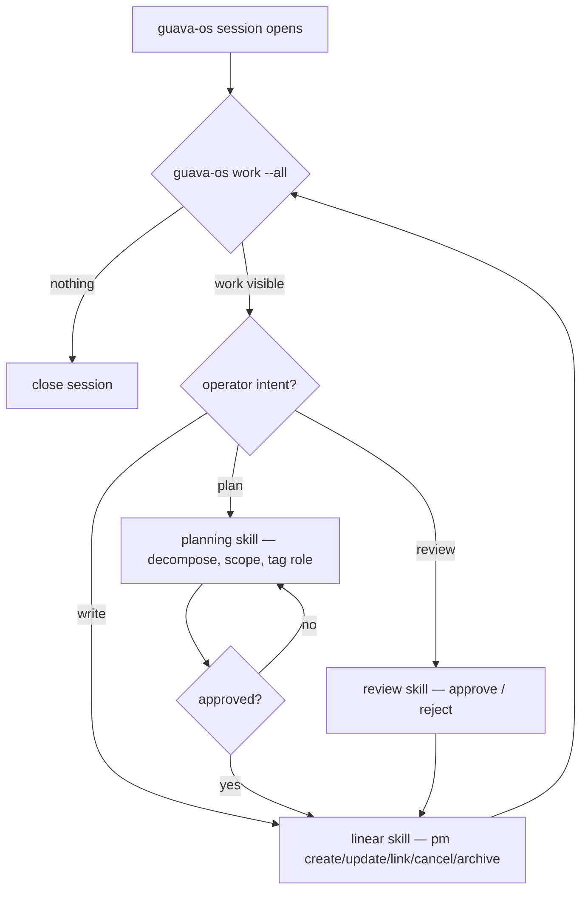

# guava-os — manager of Linear

guava-os is the control plane: it plans, scopes, and manages Linear across all
projects. It does not implement — OMP subagents in project repos do that.
It is also its own first governed consumer.

Authority: `ADR_001.md` → `docs/architecture/guava-os-operating-contract.md` →
`.guava-os/PLAYBOOK.md` → skills (`~/.agents/skills/`).

## On session open

A hook runs `guava-os work --all`. If there is nothing actionable, the session
closes. Otherwise, work through the loop below with the operator.

## Manager loop

## Routing

- **planning** — decompose work into scoped Linear deliverables (one issue = one
  observable outcome, one role label, tight acceptance).
- **linear** — every Linear write (create, update, link deps, move status,
  comment, cancel, archive).
- **review** — QA/promotion verdicts.

Roles are the 6 OMP agent types: `task`, `reviewer`, `scout`, `designer`,
`sonic`, `librarian`. An issue carries exactly one role label; that decides
which subagent a project session dispatches.

Never use Linear MCP directly — only `guava-os pm`.