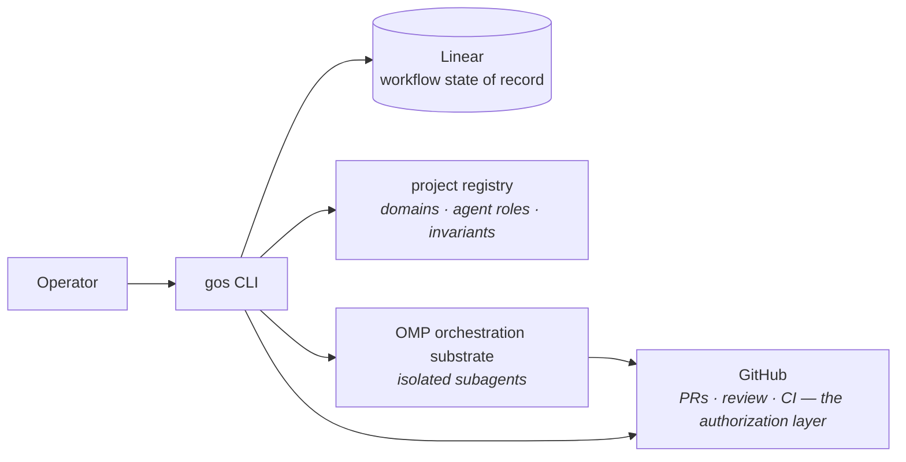

# guava-os — a control plane for agent-driven software development

Coding agents are good at implementation. Letting them directly control planning, repository state, validation, and delivery creates a different problem: **who controls the agents?** guava-os is a CLI control plane that coordinates agent work through explicit state, bounded execution, validation, and review gates.

```mermaid
flowchart TB
    I["Linear issue<br/><i>workflow state of record</i>"] --> T["gos triage<br/><i>decompose · label · scope</i>"]
    T --> R{"gos validate<br/><i>ready-for-work?</i>"}
    R -->|no| B["blocked — the issue spec gets fixed first"]
    R -->|yes| W["gos work<br/><i>one isolated agent per child task</i>"]
    W --> AG["agent implements<br/><i>commit carries the ticket id</i>"]
    AG --> V["tests + validation gates"]
    V --> PR["GitHub pull request"]
    PR --> RV{"human review + CI"}
    RV -->|approved| M["merge — issue moves to Done"]
    RV -->|changes requested| AG
    style R fill:#1e3a2f,stroke:#27c93f
    style RV fill:#1e3a2f,stroke:#27c93f
```



## See It Work

Real commands from a working session:

```console
$ gos work
project: resume-builder — ready=4 · not-ready=2 · in-progress=0 · in-review=0
  ! issue-53839813 (pm) status is "Backlog" (not Todo); readiness "untriaged"
    (needs "ready-for-work")
```

`gos work` loaded the board, found 4 dispatchable issues and 2 that are *not* dispatchable — and refused the unready ones, stating exactly what's missing (status, readiness label). The refusal is the feature: work that doesn't meet the definition-of-ready never reaches an agent.

```console
$ gos pm search --json | gos validate   # exit 0 = every issue structurally sound
```

The full loop, end to end: an issue is decomposed into bounded child tasks (each labeled with a domain and an agent role, capped by per-parent limits), each child is dispatched to an isolated subagent, work comes back as commits carrying the ticket id, tests and validation gates run, and the only path to "Done" is a reviewed pull request.

## The Problem

Agents left to run freely produce work you can't trust or even find later: unclear scope, no state of record, no gate between "the agent says it's done" and "it's actually done and reviewed." The failure isn't the agent's implementation ability — it's the absence of a system that decides what work exists, when it's ready, what context the agent receives, and what counts as valid.

That system is the interesting engineering problem. It has to be deterministic: an agent can't be trusted to grade its own homework.

## How It Works



- **Linear** is the workflow state of record. Every unit of work is an issue; nothing is tracked in someone's head.
- **The registry** defines each project's rules: issue prefix, domains, which agent role handles which domain, structural invariants (max children per parent, staleness limits, readiness labels).
- **OMP subagents** do the implementation, each in an isolated session with only the context its task specifies.
- **GitHub** is the authorization layer: branch protection, required review, CI. The control plane never merges by itself.

## Engineering Highlights

### 1. Deterministic control around probabilistic agents

The split is strict: agents decide *how* to implement; the control plane decides *what* work exists, *when* it's dispatchable, *which* agent gets it, and *what* counts as valid. There is no LLM anywhere in this repository — triage, decomposition limits, readiness checks, and validation are all deterministic code, so the enforcement layer can't drift or hallucinate.

### 2. Work decomposition with bounded fan-out

Large issues decompose into child tasks with a domain label and an agent role, capped by explicit invariants (children per parent, staleness windows, per-domain concurrency). Decomposition is a structural operation on the state of record — not a prompt asking a model to "break this down," so the plan is inspectable and diffable before any agent runs.

### 3. Gates between "agent says done" and "done"

A dispatched agent returns work; it doesn't grant completion. Readiness gates (`gos validate`, exit-code contract) block work that isn't structurally sound before dispatch, and merges only happen through GitHub's review gates after CI. Completion is a human-reviewed state transition in Linear, enforced by the same tooling that dispatched the work.

### 4. State you can reconstruct

Because Linear is the state of record and commits carry ticket ids, any piece of work can be traced from issue → dispatch → commits → PR → merge — and any checkout can be brought current with `gos sync`. Local execution is ephemeral; nothing load-bearing lives only on a laptop.

## Technical Deep Dive: the readiness gate

The gate between "an issue exists" and "an agent may act on it" is where most of the discipline lives. An issue becomes dispatchable only when its status and readiness label agree (`Todo` + `ready-for-work`), its decomposition respects the invariant caps, and its labels name a known domain and agent role. `gos work` doesn't just skip unready issues — it reports *why* each one is blocked, so the fix is a spec fix, not a prompt tweak. The same checks run standalone in `gos validate`, so CI can enforce the definition-of-ready independently of any dispatch.

## Quick Start

```bash
npm install
npm test                 # Vitest suite
npm run gos -- status    # board snapshot
npm run gos -- next      # what's dispatchable next
```

Configure per-project via a `.guava-os/config.json` (project, domains, invariants); Linear credentials come from the environment — the token loader anchors to the checkout, never prints the secret, and fails with a canonical message when unset.

## Scope & Limitations

- A local CLI, not a hosted service — no daemon, no runtime.
- Orchestrates software work; generates no code and makes no product decisions (no LLM inference in this repository).
- Not an authorization layer — GitHub's branch protection and review are; the control plane routes work to them, never around them.
- Single-operator today: the concurrency model is one operator coordinating many agent sessions.

## About

Built by Sebastian O. Rodriguez. guava-os runs the development of its own portfolio — the showcase repos in this profile were scoped, tracked, and dispatched as governed issues through it.
