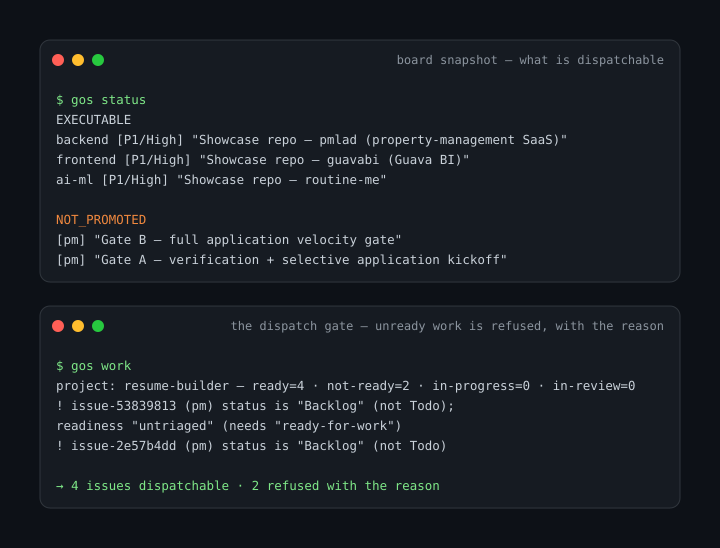
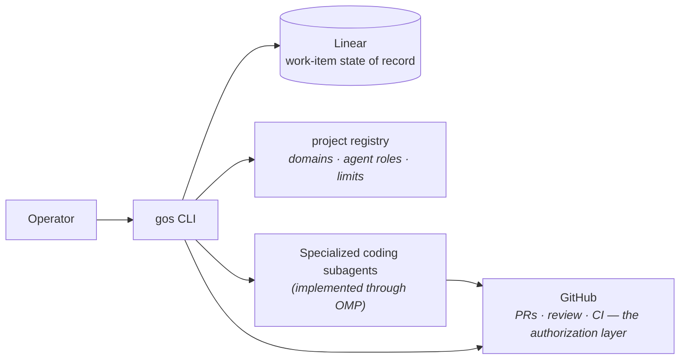

# guava-os — developer tooling for coordinating AI agents

**guava-os is developer tooling for coordinating AI agents through real software-development workflows — from planning work and dispatching tasks to tracking execution and enforcing review gates.**

Once coding agents handle more than isolated edits, implementation quality is only part of the problem: teams also need durable work state, bounded scope, validation, and review. guava-os provides that workflow around the agents rather than treating an agent's output as the end of the process — a control plane, in the technical sense of the term.

```mermaid
flowchart TB
    I["Work item enters the system"] --> T["Scope and plan<br/><i>decompose · label · readiness</i>"]
    T --> R{"Validation gate<br/><i>is this work dispatchable?</i>"}
    R -->|no| B["blocked — the work item's spec gets fixed first"]
    R -->|yes| W["Dispatch bounded work<br/><i>one isolated subagent per task</i>"]
    W --> AG["Agent implements<br/><i>commit carries the ticket id</i>"]
    AG --> V["Tests + validation gates"]
    V --> PR["Human review<br/><i>pull request + CI</i>"]
    PR -->|approved| M["Merged via GitHub — work item closed"]
    PR -->|changes requested| AG
    style R fill:#1e3a2f,stroke:#27c93f
    style PR fill:#1e3a2f,stroke:#27c93f
```



**Current workflow:** a work item enters the system → guava-os helps scope and plan it → bounded work is dispatched to a specialized coding subagent → execution state is tracked → validation and review gates determine what happens next.

## See It Work

Real states from a working session — the board snapshot, then the dispatch gate refusing unready work with its reasons:



- `gos status` shows what is dispatchable per domain and what is parked and why.
- `gos work` is the gate: 4 issues are dispatchable, 2 are refused with the exact reason (status, readiness label). Work that doesn't meet the definition-of-ready never reaches an agent.
- The full loop, end to end: a work item is decomposed into bounded child tasks (each labeled with a domain and an agent role, capped by per-parent limits), each child is dispatched to an isolated subagent, work comes back as commits carrying the ticket id, tests and validation gates run, and the only path to "done" is a reviewed pull request. Merging stays with the human reviewer; guava-os tracks the state.

## The Problem

The gap isn't the agent's implementation ability — it's everything around it: work state that survives the session, scope that bounds what the agent touches, validation that checks the result, and review that gates what ships. That surrounding workflow is the interesting engineering problem, and it has to be deterministic: an agent can't be trusted to grade its own homework.

## How It Works



- **Linear** is the work-item state of record. Every unit of work is an issue; nothing is tracked in someone's head.
- **The registry** defines each project's rules: issue prefix, domains, which agent role handles which domain, structural limits (children per parent, staleness windows, readiness labels).
- **Specialized coding subagents** do the implementation, each in an isolated session with only the context its task specifies.
- **GitHub** is the authorization layer: branch protection, required review, CI. The tooling never merges by itself.

## Engineering Highlights

### 1. Deterministic workflow around probabilistic agents

The split is strict: agents decide *how* to implement; guava-os decides *what* work exists, *when* it's dispatchable, *which* agent gets it, and *what* counts as valid. There is no LLM anywhere in this repository — planning limits, readiness checks, and validation are deterministic code, so the enforcement layer can't drift or hallucinate.

### 2. Bounded task decomposition and dispatch

Large work items decompose into child tasks with a domain label and an agent role, capped by explicit limits (children per parent, staleness windows, per-domain concurrency). Decomposition is a structural operation on the state of record — not a prompt asking a model to "break this down" — so the plan is inspectable and diffable before any agent runs.

### 3. State coordination across development tools

Linear holds the workflow state, GitHub holds the code and the review authority, and the registry holds each project's rules. Commits carry ticket ids, so any piece of work traces from work item → dispatch → commits → pull request → merge — and any checkout can be brought current with `gos sync`.

### 4. Validation before completion

A dispatched agent returns work; it doesn't grant completion. Readiness gates (`gos validate`, exit-code contract) block work that isn't structurally sound before dispatch, and completion only happens through GitHub's review gates after CI. "Done" is a human-reviewed state transition, enforced by the same tooling that dispatched the work.

## Project Status

guava-os is actively developed and used daily as an evolving workflow tool — it coordinates the development of its own portfolio.

| Capability | Status |
|---|---|
| Work-item planning, triage, and decomposition | Built |
| Bounded agent dispatch (one isolated subagent per task) | Built |
| Execution and state tracking across Linear + GitHub | Built |
| Validation gates (definition-of-ready, structural checks) | Built |
| Automated merging or unsupervised delivery | Not a goal — completion is human-reviewed by design |
| Broader automation of the planning loop | Product direction |

## Quick Start

```bash
npm install
npm test                 # Vitest suite
npm run gos -- status    # board snapshot
npm run gos -- next      # what's dispatchable next
```

Configure per-project via a `.guava-os/config.json` (project, domains, limits); Linear credentials come from the environment — the token loader anchors to the checkout, never prints the secret, and fails with a canonical message when unset.

## About

Built by Sebastian O. Rodriguez. guava-os runs the development of its own portfolio — the showcase repositories in this profile were scoped, tracked, and dispatched through it.
