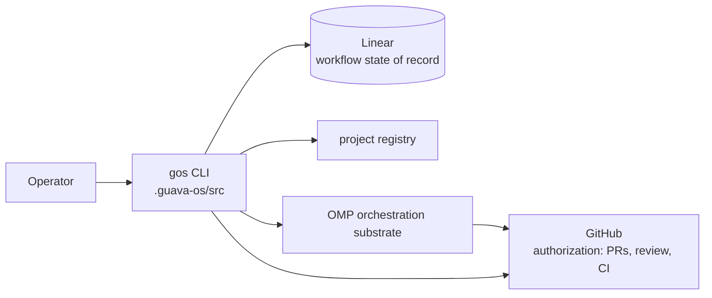

# guava-os

The guava-os control plane — a command-line tool that plans work, manages
Linear, and orchestrates OMP subagents across the governed portfolio.

## Architecture

A TypeScript command-line application (`gos`) with no runtime framework or
hosted service. It runs under Node via `tsx` and is tested with Vitest. The
source lives in `.guava-os/src/` as a set of commands (`register`, `sync`,
`triage`, `work`, `validate`, `registry`, `doctor`, `next`, `status`) built
around a Linear client (`linear-client.ts`).

## Status

- **State:** active — the canonical stable runtime for guava-os itself.
- **Deployed:** not deployed — it is a local CLI, not a hosted service.
- **Run:** `npm test` (Vitest); invoke the CLI with `npm run gos -- <command>`.

## Disclosure

guava-os orchestrates software work; it does not generate code or make product
decisions. It decomposes and tracks work in Linear, dispatches workers to OMP's
isolated subagents, and routes every merge through GitHub's review gates.

It is **not** an execution runtime (OMP executes), **not** an authorization
layer (GitHub enforces branch protection and required review), and **not** an
AI language model — there is no LLM inference, no vector search, and no custom
execution engine in this repository. Its behavior is covered by a Vitest suite
in `.guava-os/tests/`; every commit subject carries a `GUA-###` ticket id.