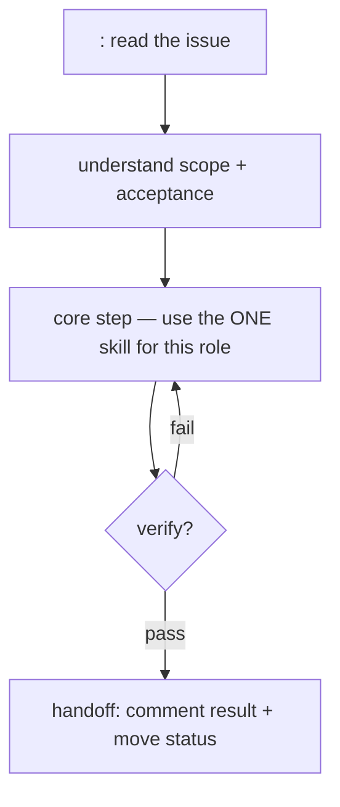

# Role decision tree — template

Each role has one decision tree in `docs/workflow/roles/<role>.md`. It tells the
role's subagent exactly what skill to use at each step — this is the
anti-AWOL guardrail.

## Shape

## Rules for writing a tree

1. One role, one primary skill.
2. Terminal step is always `linear` handoff (comment result + move status).
3. `verify` runs before any handoff when the role produces code.
4. Never merge — GitHub authorizes; the tree only reaches `In Review`.

## Fields the tree reads from the issue

- `Status` — phase (Todo → dispatch).
- `Label` — which role/subagent.
- `## Scope` / `## Acceptance` — the subagent's full picture.