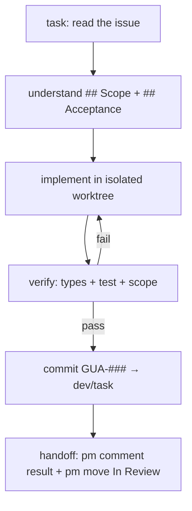

# Role: task (implement)

`task` is the general implementer. It takes a scoped issue and produces working,
verified code on `dev/task`.

## Steps

1. **Read** `pm get-issue <id>` — Why / Scope / Acceptance / Dependencies.
2. **Implement** in an isolated worktree; stay inside the issue's `## Scope`.
3. **Verify** — `verify` skill (types, test, scope-check the diff).
4. **Commit** — subject `GUA-### <outcome>`, push to `dev/task`.
5. **Hand off** — `pm comment <id>` with changed files + commit + verification,
   then `pm move <id> --status "In Review"`.

Patterns: test-first, thin handlers, one concern per change. Anti-patterns:
skipping the diff scope-check, reaching for new deps, implementing without
reading the existing layer.