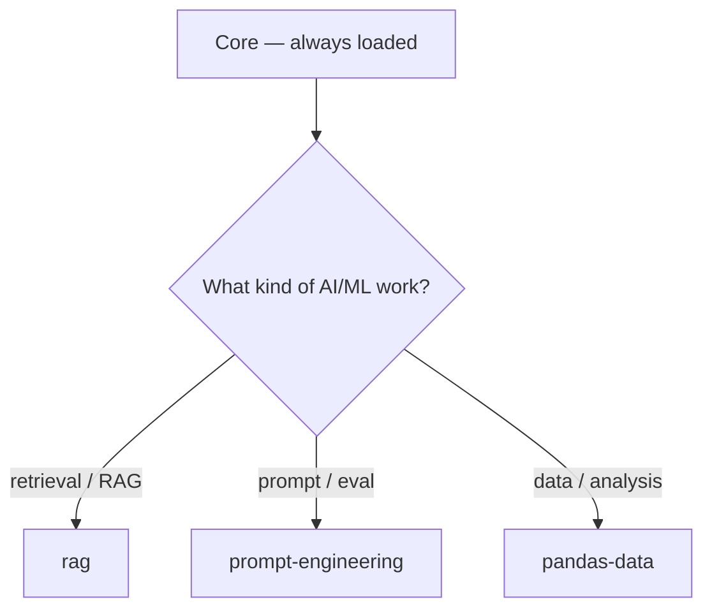

# AI / ML

Dispatched as `task` / `scout`. Load **Core** first, then follow the tree below.

## Decision tree

## Skills

### rag

_Design and build retrieval-augmented generation systems — chunking, embeddings, vector stores, hybrid search, reranking, and retrieval evaluation. Use for semantic search, document retrieval, knowledge-grounded AI, or vector-database work._

## Retrieval-Augmented Generation

Production RAG is an ingestion pipeline plus a retrieval pipeline. Design each
step, then validate it with metrics before wiring in the LLM.

## Workflow

1. **Requirements** — retrieval needs, latency budget, accuracy target, scale.
2. **Vector store** — pick DB, schema, index, sharding to match the query load.
3. **Chunking** — split strategy, overlap, semantic boundaries, metadata.
4. **Retrieval pipeline** — embedding model, query transform, hybrid search, rerank.
5. **Evaluate & iterate** — metric tracking, retrieval debugging, optimization.

## Chunking

- Tune `chunk_size` on real domain data — never ship a default blindly.
- Overlap small (~10–15%) to reduce split-boundary context loss.
- Split on semantic boundaries (paragraphs, then sentences, then words).
- Enrich every chunk with `source`, `section`, `timestamp` metadata.

## Embeddings & indexing

- Benchmark multiple embedding models on your corpus before committing.
- Store model name + dimension as version metadata; plan for migration.
- Deduplicate with deterministic IDs (hash of chunk content) so ingestion is idempotent.
- Never hardcode provider API keys in application code.

## Hybrid search

- Combine dense (vector) with sparse (BM25 / keyword); cosine alone fails on exact terms and multi-domain corpora.
- Merge with reciprocal rank fusion or a weighted score blend.
- Apply metadata filters (tenant, source, date) at query time.

## Reranking & evaluation

- Rerank top-k candidates with a cross-encoder before stuffing context.
- Track precision@k, recall@k, MRR, NDCG; also RAGAS `context_precision`, `context_recall`, `faithfulness`, `answer_relevancy`.
- Gate LLM integration on thresholds (e.g. context_precision ≥ 0.7, recall ≥ 0.6).

## Rules

DO:
- Hybrid search and metadata filters in production.
- Idempotent ingestion with dedup and deterministic IDs.
- Monitor retrieval latency and quality over time.

DON'T:
- Skip metadata enrichment.
- Judge retrieval by LLM output quality alone.
- Couple the embedding model tightly to application code.

## Uses

- Building a RAG pipeline, vector database, or knowledge-grounded app
- Selecting chunking/embedding/hybrid-search strategy for a corpus
- Debugging poor retrieval quality or setting evaluation baselines

## Source

Upstream: Jeffallan/claude-skills — `skills/rag-architect`

### prompt-engineering

_Design, optimize, and evaluate LLM prompts — chain-of-thought, few-shot, structured output, and evaluation. Use when writing prompts, refactoring for accuracy or token efficiency, or building a prompt test suite._

## Prompt Engineering

Write prompts like code: version them, test them against diverse inputs, and
change one thing at a time when debugging.

## Workflow

1. **Understand requirements** — task, success criteria, constraints, edge cases.
2. **Design** — pick a pattern (zero-shot, few-shot, CoT) and write clear instructions.
3. **Test** — run diverse cases, measure accuracy/consistency. If < 80% on the test set, find failure patterns before iterating.
4. **Iterate** — one change at a time; reduce tokens, improve reliability.
5. **Deploy** — version, document behavior, monitor for drift.

## Patterns

- **Zero-shot** — baseline; state task, format, and constraints explicitly.
- **Few-shot** — add examples that match the target distribution; never contradict instructions.
- **Chain-of-thought / ReAct** — for multi-step reasoning or tool use.
- **Structured output** — prefer JSON mode / function calling; validate against a schema.

## Optimization

- Replace vague instructions with explicit shape: count, format, verb constraints.
- Few-shot beats zero-shot for format reliability; keep examples consistent with the rubric.
- Cut tokens after correctness, not before.
- Test across model versions — prompts do not transfer perfectly.

## Evaluation

- Build a labeled test suite: diverse, realistic, including empty/malformed edge inputs.
- Measure quantitative metrics (accuracy, consistency); validate structured outputs against schemas.
- A/B compare against a baseline before deploying.

## Rules

DO:
- Version prompts and document known limitations.
- Consider token cost and latency in the design.
- Test edge cases (empty inputs, unusual formats).

DON'T:
- Deploy without systematic evaluation.
- Make multiple changes at once when debugging.
- Hardcode sensitive data in prompts or examples.

## Uses

- Designing or refactoring prompts for LLM apps, agents, or pipelines
- Building JSON/function-calling schemas and output validation
- Setting up prompt evaluation or regression test suites

## Source

Upstream: Jeffallan/claude-skills — `skills/prompt-engineer`

### pandas-data

_Manipulate and transform DataFrames efficiently — cleaning, aggregation, groupby, merges, and time series. Use for pandas data wrangling, joining tables, resampling, or optimizing large datasets._

## Pandas Data

Vectorize everything, set dtypes deliberately, and validate shape/null counts
before declaring a transform done.

## Workflow

1. **Assess** — `dtypes`, `memory_usage(deep=True)`, `isna().sum()`, `describe(include="all")`.
2. **Design** — plan vectorized ops; identify the indexing strategy.
3. **Implement** — vectorized methods, method chaining, `.loc`/`.iloc`.
4. **Validate** — assert shapes, dtypes, null counts, and row counts.
5. **Optimize** — categorical dtypes, numeric downcasting, chunking for large data.

## Patterns

- **Vectorize, loop as last resort** — `df['tax'] = df['price'] * 0.2`, never `iterrows` for arithmetic.
- **Safe subset mutation** — `.loc[mask].copy()` then mutate; avoid chained indexing `df['A']['B']`.
- **GroupBy with `observed=True`** — then `.agg(named_aggs=('col','func'))` and `.reset_index()`.
- **Merge with validation** — `pd.merge(..., how='left', validate='m:1', indicator=True)` then inspect `_merge`.
- **Missing values** — forward-fill/linear-interpolate numerics; mode for categoricals, median for numerics; never silently drop.
- **Time series** — `set_index()` then `.resample('D').agg(...).fillna(0)`.
- **Pivot** — `pivot_table(values, index, columns, aggfunc, fill_value=0, margins=True)`.
- **Memory** — `astype('category')` for low-cardinality strings; `pd.to_numeric(..., downcast='integer'/'float')`.

## Rules

DO:
- Check `memory_usage(deep=True)` on large frames.
- Handle missing values explicitly.
- Preserve index integrity through operations.
- Use `pd.concat()` over deprecated `.append()`.

DON'T:
- Iterate with `.iterrows()` unless unavoidable.
- Ignore `SettingWithCopyWarning`.
- Load entire large datasets without chunking.
- Assume data is clean without validation.

## Uses

- Data cleaning, aggregation, and transformation tasks
- Joining/merging tables and reshaping (pivot, crosstab)
- Time-series resampling and memory/performance tuning

## Source

Upstream: Jeffallan/claude-skills — `skills/pandas-pro`

