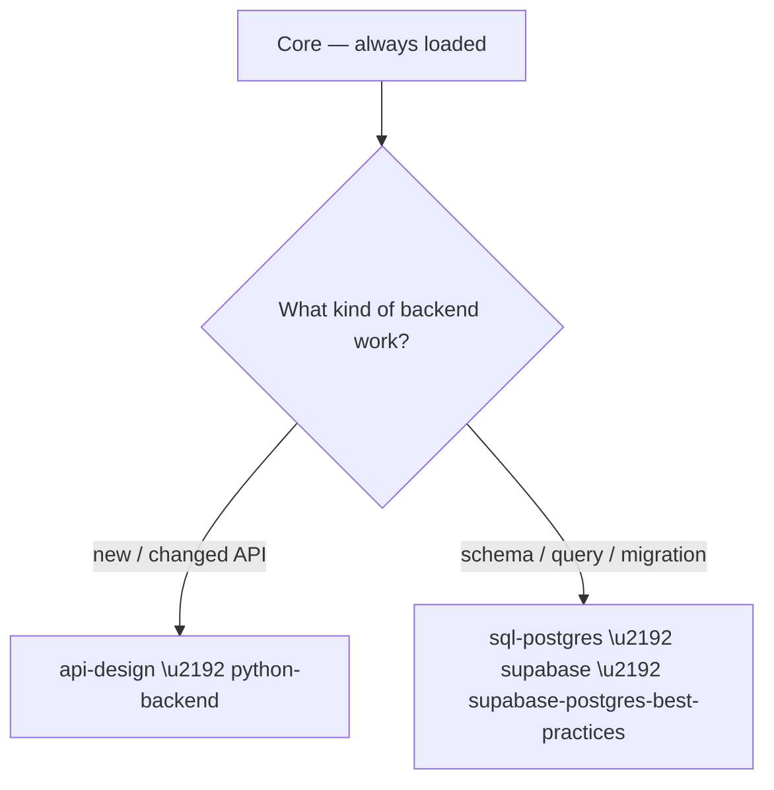

# Backend

Dispatched as `task` / `sonic`. Load **Core** first, then follow the tree below.

## Decision tree



## Skills

### api-design

_Use to design HTTP APIs (REST + OpenAPI 3.1) or GraphQL schemas and resolvers. Covers resource modeling, versioning, pagination, error contracts, and GraphQL DataLoader/federation patterns._

## Purpose

Design contracts that clients can consume and evolve safely: REST-first with OpenAPI 3.1, or GraphQL when clients need flexible shapes across a graph of types.

## Choose REST vs GraphQL

| Need | Choice |
|------|--------|
| CRUD, caching, simple clients, HTTP semantics | REST + OpenAPI |
| Client-driven shapes, many joined types, real-time | GraphQL |

## REST Design Rules

- Resource nouns, not verbs: `/users/{id}` and `POST /users`, never `/getUser`.
- Pick one naming convention (snake_case or camelCase) — apply everywhere, response and query params.
- Full HTTP semantics: `201` for create, `204` for no-content, `409` for conflict, `429` for rate-limit.
- Paginate **every** collection; prefer cursor/keyset for large sets, offset for small/simple.
- Errors: RFC 7807 Problem Details (`application/problem+json`) — stable `type` URI, `title`, `status`, actionable `detail`; `errors[]` for field-level failures.
- Version with a strategy before you ship: URI or header; deprecate explicitly (`Deprecation`/`Sunset` headers); never break without a migration path.
- Document auth/z in the spec; include request/response examples for at least happy + error paths.
- Never expose implementation detail (ORM fields, internal ids) in the API surface.

### Error response shape

```yaml
type: object
required: [type, title, status]
properties:
  type:     { type: string, format: uri }          # stable, documented
  title:    { type: string }
  status:   { type: integer }
  detail:   { type: string }                       # human-readable, actionable
  instance: { type: string, format: uri }
```

## OpenAPI 3.1

- Use OpenAPI `3.1.0` (not 3.0): `nullable` → `type: [t, "null"]` unions.
- Centralize reusable schemas/responses in `components`; `$ref` instead of duplication.
- Validate the spec (`@redocly/cli lint`) and mock (`@stoplight/prism-cli mock`) before promising the contract.
- `format` for scalars (`uuid`, `email`, `date-time`); `operationId` on every operation.

## GraphQL Rules

- Schema-first: design SDL types/interfaces/unions before resolver code.
- camelCase everywhere; `ID!` for identifiers; non-null (`!`) only where the field is *always* present — nullable (`T`) for anything that can fail or defer.
- Never return null for a declared non-null field — resolve errors per-field, not global 500s.
- Kill N+1 with `DataLoader`: one instance per request, batch by `id IN (...)`, return in the **same order** as input keys.
- Limit abuse: query depth + complexity analysis (`maximumComplexity`), pagination (`first`/`after`) on list fields.
- Auth at the field level via context; never pass auth state through resolver args.
- Document types/fields; provide example queries for every operation.

### DataLoader (per-request batching)

```js
user: new DataLoader(async (ids) => {
  const rows = await db.users.findMany({ where: { id: { in: ids } } });
  return ids.map((id) => rows.find((r) => r.id === id) ?? null);  // preserve order
})
```

### Federation essentials (Apollo 2.5+)

- `type Product @key(fields: "id")` owns its fields; extending subgraphs mark foreign fields `@external`.
- `@shareable` on types/fields multiple subgraphs resolve; compose with `rover` and confirm every `@key` resolves before deploy.

## Uses

- Designing a new REST/GraphQL API or OpenAPI spec
- Reviewing an existing API contract for consistency and evolution safety
- Pagination, error-catalog, versioning, or federation design work

## Source

Jeffallan/claude-skills — distilled from skills: api-designer, graphql-architect.

### python-backend

_Use when building Python backend services — type-safe Python 3.11+, async FastAPI APIs (Pydantic v2), or Django/DRF apps. Covers type hints, async patterns, ORM query optimization, auth, and tests._

## Purpose

Author correct, type-safe, async-first Python backends. Pick the stack by constraints, and keep each layer's core rules sharp.

## Stack Selection

| Situation | Choice |
|-----------|--------|
| Async API, schema-first, OpenAPI docs needed | FastAPI + Pydantic v2 |
| Batteries-included: admin, ORM, content site | Django + DRF |
| Generic Python module/lib | python-pro patterns only |

## Type Hints (python-pro)

- Annotate every public signature and class attribute (`mypy --strict` must pass).
- Use `X | None` and builtin generics (`dict[str, str]`, `list[int]`) — never `Optional[x]` / `typing.List`.
- Prefer `@dataclass` over manual `__init__`; validate in `__post_init__`, not scattered call sites.
- Use `Protocol` for structural interfaces, `Annotated` for dependency markers.
- Never mutable default args (`[]`, `{}`); use `field(default_factory=...)`.
- Never bare `except:`; never ignore mypy errors by `# type: ignore` without a reason.
- Use `pathlib` over `os.path`; context managers (`with`) for all resources.

## Async Patterns

- `async/await` for all I/O (DB, HTTP, fs); never `time.sleep` / blocking calls inside a coroutine.
- Fan out with `asyncio.gather` (or `asyncio.TaskGroup` on 3.11+) over sequential awaits.
- Use an async client (`httpx.AsyncClient`) and async DB engine (async SQLAlchemy / `aiosqlite`).
- Reuse connections/sessions via lifespan or dependency; don't mint one per request.
- Background work is long-lived (queue/worker), not `asyncio.create_task` you can't observe.

## FastAPI (async APIs)

- Use Pydantic **v2** syntax: `field_validator`, `model_validator`, `model_config` — never `@validator` / `class Config`.
- Set `model_config = ConfigDict(from_attributes=True, str_strip_whitespace=True)` on response/schema models.
- Dependency injection via `Annotated[Dep, Depends(...)]` — type-alias it (e.g. `DbDep`) and reuse.
- Separate schema (request/response) from ORM model; never expose the ORM object or hashed password in responses.
- Return explicit status codes; `409 Conflict` for duplicate, `201` for created; correct semantics over convenience.
- Async endpoints use async SQLAlchemy (`select`, `scalar_one_or_none`); never sync DB inside async routes.
- Auth: JWT via `OAuth2PasswordBearer`; `get_current_user` raises `401` on invalid token; secrets from env, never hardcoded.
- Type hints are not optional in FastAPI — they drive validation *and* OpenAPI.

## Django / DRF

- Add `db_index` / `Meta.indexes` for frequently filtered, joined, or ordered fields.
- Kill N+1: `select_related` (FK, one-to-one) and `prefetch_related` (M2M, reverse FK) in `get_queryset`.
- DRF: `ModelSerializer` with field-level `validate_<field>`; read-only derived fields via `source=`; `perform_create` to attach `request.user`.
- Permissions on every endpoint (`IsAuthenticatedOrReadOnly` at minimum); never trust raw user input.
- Secrets via environment variables; `DEBUG=False`, `SECRET_KEY`/DB creds never literals in `settings.py`.
- Parameterize raw SQL (`%s` placeholders) — never string-interpolate user input.

## Tests

- pytest: shared state via `@pytest.fixture`; `tmp_path` for files; `@pytest.mark.parametrize` for boundaries.
- Async: `pytest-asyncio` + `httpx.AsyncClient`; reraise asyncio strict mode (no silent swallows).
- Django: `APITestCase`, `force_authenticate`; assert status codes and one non-trivial body field, not just `200`.
- Mock only I/O boundaries; keep business logic real.

## Uses

- Building or auditing a Python/FastAPI/Django service or API
- Writing type-safe, async-first, test-covered backend code
- Reviewing ORM query patterns, Pydantic schemas, or DRF serializers
- Migrating between stacks (Django→FastAPI or reverse)

## Source

Jeffallan/claude-skills — distilled from skills: python-pro, fastapi-expert, django-expert.

### sql-postgres

_Use to optimize PostgreSQL queries, design indexes, and write complex SQL (window functions, CTEs, JSONB) or migrations. Complements the supabase skills for hosted Postgres specifics._

## Purpose

Make queries fast and correct: analyze before optimizing, prefer set-based SQL, verify every index gets used. Engine-level SQL/indexing — pair with `supabase` skills for hosted platform, RLS, and CLI.

## Workflow

1. **Analyze** — `EXPLAIN (ANALYZE, BUFFERS)` on real data volumes; find Seq Scans and row-estimate mismatches.
2. **Rewrite** — set-based SQL (CTEs, WINDOW, joins) instead of cursors / correlated subqueries.
3. **Index** — targeted or covering index, verified used.
4. **Maintain** — `ANALYZE` after bulk changes; watch VACUUM/bloat.

## Query Optimization Rules

- Analyze the plan *before* recommending any index; never index speculatively.
- Filter early: push `WHERE` into subqueries/CTEs — the deeper the filter, the less work downstream.
- Set-based over row-by-row: replace correlated subqueries with an aggregation `LEFT JOIN`, `GROUP BY`.
- `EXISTS` for existence checks, never `COUNT(*) > 0`.
- Handle NULLs explicitly in comparisons and aggregations (`COALESCE`, `NULLIF`).
- Never `SELECT *` in production queries; list columns so covering indexes can work.
- Refresh stats (`ANALYZE <table>`) when actual rows ≫ estimated rows.

## Window Functions / CTEs

```sql
-- latest completed order per customer (row_number over partition)
WITH ranked AS (
  SELECT customer_id, order_id, total_amount,
         ROW_NUMBER() OVER (PARTITION BY customer_id ORDER BY order_date DESC) AS rn
  FROM orders
  WHERE status = 'completed'
)
SELECT * FROM ranked WHERE rn = 1;
```
- `ROW_NUMBER` / `RANK` / `LAG` / `LEAD` zero self-joins for analytics.
- `SUM(...) OVER (PARTITION BY ... ORDER BY ...)` for running totals.
- In Postgres 12+, CTEs are inlined unless `MATERIALIZED`/`RECURSIVE` — don't assume an optimization fence.

## EXPLAIN Reading

Run `EXPLAIN (ANALYZE, BUFFERS, FORMAT TEXT)` and check:
- `Seq Scan` on a large table → add/fix an index.
- `actual rows` ≫ `estimated` → `ANALYZE` to refresh stats.
- `Buffers: read` heavy → missing warm cache or index; `hit` is good.

## Indexing

| Query shape | Index |
|-------------|-------|
| Equality / range on key | B-tree (default) |
| `LIKE '%x%'` / trigram | GIN + `pg_trgm` |
| JSONB containment (`@>`) | GIN |
| geo / full-text | GiST / GIN |
| Large append-only, time-range | BRIN |

- Compound index: equality columns first, order of predicates matters.
- `INCLUDE (col)` for covering indexes that avoid heap fetches.
- Partial index `WHERE status = 'pending'` shrinks size for hot filtered queries.
- Use `CREATE INDEX CONCURRENTLY` in production (no write lock); verify with `EXPLAIN` before *and* after.
- Use `uuid` type for UUIDs (not `text`) and always parameterized/prepared statements.

## Migrations

- One migration = one logical change; never fold multiple concerns into one.
- Idempotent, versionable, reversible where possible; forward-only is legitimate only if documented.
- Big tables: add index concurrently, add column with default via backfill, avoid long `ACCESS EXCLUSIVE` locks.
- Test migration up *and* down on a near-production-size copy.
- High-churn table: run `VACUUM (ANALYZE)` after backfill; tune `autovacuum_vacuum_scale_factor` before disabling anything.

## Maintenance

- Never disable autovacuum globally; tune per-table threshold for high churn.
- Monitor bloat: `pg_stat_user_tables` `n_dead_tup` vs `n_live_tup`.
- Connection pooling (pgBouncer) under concurrency.

## Uses

- Diagnosing a slow query or missing index
- Writing complex SQL (CTEs, window functions, JSONB)
- Reviewing migrations and their locking behavior
- Index design and EXPLAIN verification for Postgres

## Source

Jeffallan/claude-skills — distilled from skills: sql-pro, postgres-pro; complements the installed supabase skills.

### supabase

_Use when doing ANY task involving Supabase. Triggers: Supabase products (Database, Auth, Edge Functions, Realtime, Storage, Vectors, Cron, Queues); client libraries and SSR integrations (supabase-js, @supabase/ssr) in Next.js, React, SvelteKit, Astro, Remix; auth issues (login, logout, sessions, JWT, cookies, getSession, getUser, getClaims, RLS); Supabase CLI or MCP server; schema changes, migrations, declarative schemas, security audits, Postgres extensions (pg_graphql, pg_cron, pg_vector); debugging and troubleshooting errors or unexpected behavior on Supabase projects (HTTP errors, Postgres errors, RLS surprises, permission denied, schema cache issues, timeouts, Edge Function crashes, Realtime drops, Storage failures) and reading or querying logs (Logs Explorer, ClickHouse)._

# Supabase

## Core Principles

**1. Supabase changes frequently — verify against changelog and current docs before implementing.**
Do not rely on training data for Supabase features. Function signatures, config.toml settings, and API conventions change between versions.

First, fetch `https://supabase.com/changelog.md` (a lightweight summary index — not a heavy pull), scan for `breaking-change` tags relevant to your task, and follow the linked page for any that apply. Then look up the relevant topic using the documentation access methods below.

**2. Verify your work.**
After implementing any fix, run a test query to confirm the change works. A fix without verification is incomplete.

**3. Recover from errors, don't loop.**
If an approach fails after 2-3 attempts, stop and reconsider. Try a different method, check documentation, inspect the error more carefully, and review relevant logs when available. Supabase issues are not always solved by retrying the same command, and the answer is not always in the logs, but logs are often worth checking before proceeding.

**4. Exposing tables to the Data API:** Depending on the user's [Data API settings](https://supabase.com/dashboard/project/<ref>/integrations/data_api/settings), newly created tables may not be automatically exposed via the Data (REST) API. If this is the case, `anon` and `authenticated` roles will need to be explicitly granted access.

> Note that this is separate from RLS, which controls which _rows_ are visible once a table is accessible, not whether the table is accessible at all.

When a user reports a SQL-created table is unexpectedly inaccessible, check their Data API settings and whether the roles have been granted access via explicit `GRANT` SQL. When granting public (`anon`/`authenticated`) access, always enable RLS too. See [Exposing a Table to the Data API](https://supabase.com/docs/guides/api/securing-your-api.md) for the full setup workflow.

**5. RLS in exposed schemas.**
Enable RLS on every table in any exposed schema, which includes `public` by default. This is critical in Supabase because tables in exposed schemas can be reachable through the Data API when the `anon`/`authenticated` roles have access (see [Exposing a Table to the Data API](https://supabase.com/docs/guides/api/securing-your-api.md)). For private schemas, prefer RLS as defense in depth. After enabling RLS, create policies that match the actual access model rather than defaulting every table to the same `auth.uid()` pattern.

**6. Security checklist.**
When working on any Supabase task that touches auth, RLS, views, storage, or user data, run through this checklist. These are Supabase-specific security traps that silently create vulnerabilities:

- **Auth and session security**
  - **Never use `user_metadata` claims in JWT-based authorization decisions.** In Supabase, `raw_user_meta_data` is user-editable and can appear in `auth.jwt()`, so it is unsafe for RLS policies or any other authorization logic. Store authorization data in `raw_app_meta_data` / `app_metadata` instead.
  - **Deleting a user does not invalidate existing access tokens.** Sign out or revoke sessions first, keep JWT expiry short for sensitive apps, and for strict guarantees validate `session_id` against `auth.sessions` on sensitive operations.
  - **If you use `app_metadata` or `auth.jwt()` for authorization, remember JWT claims are not always fresh until the user's token is refreshed.**

- **API key and client exposure**
  - **Never expose the `service_role` or secret key in public clients.** Prefer publishable keys for frontend code. Legacy `anon` keys are only for compatibility. In Next.js, any `NEXT_PUBLIC_` env var is sent to the browser.

- **RLS, views, and privileged database code**
  - **Views bypass RLS by default.** In Postgres 15 and above, use `CREATE VIEW ... WITH (security_invoker = true)`. In older versions of Postgres, protect your views by revoking access from the `anon` and `authenticated` roles, or by putting them in an unexposed schema.
  - **UPDATE requires a SELECT policy.** In Postgres RLS, an UPDATE needs to first SELECT the row. Without a SELECT policy, updates silently return 0 rows — no error, just no change.
  - **`auth.role()` is deprecated — use the `TO` clause instead.** Supabase has deprecated `auth.role()` in favour of specifying the target role directly on the policy with `TO authenticated` or `TO anon`. Beyond deprecation, `auth.role() = 'authenticated'` breaks silently when anonymous sign-ins are enabled, because anonymous users carry the `authenticated` Postgres role and pass the check regardless of whether the user is genuinely signed in.
    ```sql
    -- Deprecated (do not use)
    create policy "example" on table_name for select
    using ( auth.role() = 'authenticated' );
    ```
  - **`TO authenticated` alone is authentication without authorization (BOLA / IDOR).** Using `TO authenticated` only checks the role — it does not restrict which rows a user can access. The correct pattern combines `TO authenticated` with an ownership predicate in `USING`:
    ```sql
    create policy "example" on table_name for select
    to authenticated
    using ( (select auth.uid()) = user_id );
    ```
  - **UPDATE policies require both `USING` and `WITH CHECK`.** Without `WITH CHECK`, a user can reassign a row's `user_id` to another user:
    ```sql
    create policy "example" on table_name for update
    to authenticated
    using ( (select auth.uid()) = user_id )
    with check ( (select auth.uid()) = user_id );
    ```
  - **`SECURITY DEFINER` functions bypass RLS.** A `SECURITY DEFINER` function runs with its creator's privileges — typically a role with `bypassrls` (e.g., `postgres`). Never add `SECURITY DEFINER` to resolve a permission error; it silently removes access control without fixing the underlying cause. Prefer `SECURITY INVOKER`.
  - **`SECURITY DEFINER` functions in `public` are callable by all roles.** Postgres grants `EXECUTE` to `PUBLIC` by default for every new function, so any `SECURITY DEFINER` function in `public` is a public API endpoint callable by `anon` and `authenticated` (which inherit from `PUBLIC`) without any additional grant. When `SECURITY DEFINER` is genuinely needed (e.g., bypassing RLS on an internal lookup table), keep the function in a non-exposed schema, always include an `auth.uid()` check in the function body, and run `supabase db advisors` after making changes.

- **Storage access control**
  - **Storage upsert requires INSERT + SELECT + UPDATE.** Granting only INSERT allows new uploads but file replacement (upsert) silently fails. You need all three.

- **Dependency and supply-chain security**
  - **Always pin package versions and commit lockfiles** when installing Supabase packages (`supabase-js`, `@supabase/ssr`, `supabase-py`, etc.). See the [npm security guide](https://supabase.com/docs/guides/security/npm-security.md) for the full checklist.

For any security concern not covered above, fetch the Supabase product security index: `https://supabase.com/docs/guides/security/product-security.md`

## Supabase CLI

Always discover commands via `--help` — never guess. The CLI structure changes between versions.

```bash
supabase --help                    # All top-level commands
supabase <group> --help            # Subcommands (e.g., supabase db --help)
supabase <group> <command> --help  # Flags for a specific command
```

**Supabase CLI Known gotchas:**

- `supabase db query` requires **CLI v2.79.0+** → use MCP `execute_sql` or `psql` as fallback
- `supabase db advisors` requires **CLI v2.81.3+** → use MCP `get_advisors` as fallback
- In imperative migration projects, create new hand-authored migration files with `supabase migration new <name>` first. Never invent a migration filename or rely on memory for the expected format. Declarative schema projects generate migrations from `supabase/schemas/`; see "Making and Committing Schema Changes" below.

**Version check and upgrade:** Run `supabase --version` to check. For CLI changelogs and version-specific features, consult the [CLI documentation](https://supabase.com/docs/reference/cli/introduction) or [GitHub releases](https://github.com/supabase/cli/releases).

## Supabase MCP Server

For setup instructions, server URL, and configuration, see the [MCP setup guide](https://supabase.com/docs/guides/getting-started/mcp).

**Troubleshooting connection issues** — follow these steps in order:

1. **Check if the server is reachable:**
   `curl -so /dev/null -w "%{http_code}" https://mcp.supabase.com/mcp`
   A `401` is expected (no token) and means the server is up. Timeout or "connection refused" means it may be down.

2. **Check `.mcp.json` configuration:**
   Verify the project root has a valid `.mcp.json` with the correct server URL. If missing, create one pointing to `https://mcp.supabase.com/mcp`.

3. **Authenticate the MCP server:**
   If the server is reachable and `.mcp.json` is correct but tools aren't visible, the user needs to authenticate. The Supabase MCP server uses OAuth 2.1 — tell the user to trigger the auth flow in their agent, complete it in the browser, and reload the session.

## Supabase Documentation

Before implementing any Supabase feature, find the relevant documentation. Use these methods in priority order:

1. **MCP `search_docs` tool** (preferred — returns relevant snippets directly)
2. **Fetch docs pages as markdown** — any docs page can be fetched by appending `.md` to the URL path.
3. **Web search** for Supabase-specific topics when you don't know which page to look at.

## Making and Committing Schema Changes

First decide which schema workflow the project uses.

### Option A: Declarative schemas

Use this when `supabase/schemas/` exists or `config.toml` sets `schema_paths`. Edit the desired schema state in those files, then generate and review the migration. Do not start by hand-writing a migration. See the [Declarative database schemas guide](https://supabase.com/docs/guides/local-development/declarative-database-schemas).

### Option B: Imperative migrations

Use this when the project does not use declarative schemas.

**To make schema changes, use `execute_sql` (MCP) or `supabase db query` (CLI).** These run SQL directly on the database without creating migration history entries, so you can iterate freely and generate a clean migration when ready.

Do NOT use `apply_migration` to change a local database schema — it writes a migration history entry on every call, which means you can't iterate, and `supabase db diff` / `supabase db pull` will produce empty or conflicting diffs. If you use it, you'll be stuck with whatever SQL you passed on the first try.

**When ready to commit** your changes to a migration file:

1. **Run advisors** → `supabase db advisors` (CLI v2.81.3+) or MCP `get_advisors`. Fix any issues.
2. **Review the Security Checklist above** if your changes involve views, functions, triggers, or storage.
3. **Generate the migration** → `supabase db pull <descriptive-name> --local --yes`
4. **Verify** → `supabase migration list --local`

## Debugging

When you get an error on a Supabase-related request, for example an error code from the Supabase REST API, Postgres database, or PostgREST, an empty result, getting blocked by RLS unexpectedly, or an error from a Supabase service like Auth, Realtime, Edge Functions, or Storage, you **must** fetch Supabase's [Monitoring and Debugging](https://supabase.com/docs/guides/monitoring-and-debugging.md) documentation before diagnosing or proposing a fix, rather than working from memory. The same docs also cover performance optimizations, such as slow queries and missing indexes.

## Reference Guides

- **Skill Feedback** → [references/skill-feedback.md](references/skill-feedback.md)
  **MUST read when** the user reports that this skill gave incorrect guidance or is missing information.

### supabase-postgres-best-practices

_Postgres best practices maintained by Supabase, for Postgres running anywhere. Load this skill BEFORE writing or changing anything that lives in a Postgres database: creating or altering tables and columns (including choosing column types), schema design, migrations and declarative schema files, RLS policies and the tests that verify them, indexes, triggers, database functions, queues and scheduled jobs (pg_cron, pgmq), vector/semantic search (pgvector), and restoring dumps (pg_restore) or importing data. Also load it when diagnosing slow queries, high CPU, timeouts, EXPLAIN plans, connection exhaustion, locking, bloat, or rows visible to the wrong user or tenant. This is not just a performance guide — schema, migration, security, and SQL authoring tasks need these rules too, even for a one-column change or a single query._

# Supabase Postgres Best Practices

Comprehensive performance optimization guide for Postgres, maintained by Supabase. Contains rules across 8 categories, prioritized by impact to guide automated query optimization and schema design.

## When to Apply

Reference these guidelines when:
- Writing SQL queries or designing schemas
- Implementing indexes or query optimization
- Reviewing database performance issues
- Configuring connection pooling or scaling
- Optimizing for Postgres-specific features
- Working with Row-Level Security (RLS)

## Rule Categories by Priority

| Priority | Category | Impact | Prefix |
|----------|----------|--------|--------|
| 1 | Query Performance | CRITICAL | `query-` |
| 2 | Connection Management | CRITICAL | `conn-` |
| 3 | Security & RLS | CRITICAL | `security-` |
| 4 | Schema Design | HIGH | `schema-` |
| 5 | Concurrency & Locking | MEDIUM-HIGH | `lock-` |
| 6 | Data Access Patterns | MEDIUM | `data-` |
| 7 | Monitoring & Diagnostics | LOW-MEDIUM | `monitor-` |
| 8 | Advanced Features | LOW | `advanced-` |

## How to Use

Read individual rule files for detailed explanations and SQL examples:

```
references/query-missing-indexes.md
references/query-partial-indexes.md
references/_sections.md
```

Each rule file contains:
- Brief explanation of why it matters
- Incorrect SQL example with explanation
- Correct SQL example with explanation
- Optional EXPLAIN output or metrics
- Additional context and references
- Supabase-specific notes (when applicable)

## References

- https://www.postgresql.org/docs/current/
- https://supabase.com/docs
- https://wiki.postgresql.org/wiki/Performance_Optimization
- https://supabase.com/docs/guides/database/overview
- https://supabase.com/docs/guides/auth/row-level-security

