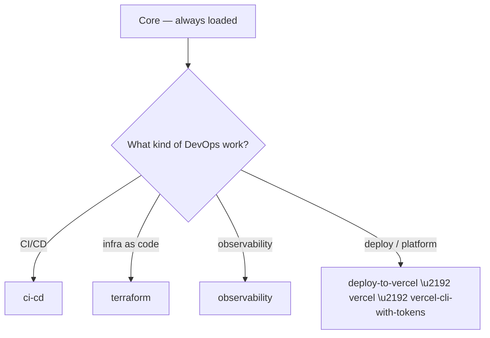

# DevOps

Dispatched as `task`. Load **Core** first, then follow the tree below.

## Decision tree



## Skills

### ci-cd

_Design and operate CI/CD pipelines, deployment automation, and promotion gates; use when authoring GitHub Actions workflows, containerizing apps, or planning gated production rollouts._

## Purpose

Plan and implement build, package, and deploy automation with explicit promotion gates and rollback.

## Workflow

1. **Assess** — application, environments, deployment requirements
2. **Design** — pipeline stages, triggers, promotion gates
3. **Implement** — workflow files, Dockerfiles, deploy manifests
4. **Validate** — lint configs, run build/tests; confirm no destructive changes
5. **Approve** — production deploys require explicit approval; block on withheld approval
6. **Deploy** — rollout + smoke tests; document rollback before going live

## Pipeline Rules

- Gate promotion on stage verification; never push straight to production.
- Pin artifact versions by git SHA; never tag production `latest`.
- Store secrets in secret managers (GitHub Secrets, Vault); never in code, env files, or CI variables.
- Run container/image scanning in the pipeline (Trivy, Grype).
- Wait for health/readiness probes before marking a deploy complete.
- Prefer GitOps for Kubernetes (ArgoCD, Flux) over imperative `kubectl apply`.

## Deployment Strategies

| Strategy | Use when |
|----------|----------|
| Rolling | default; zero-downtime with N+1 capacity |
| Blue-green | instant rollback; full duplicate environment |
| Canary | gradual traffic shift; route by weight |

## MUST NOT

- Deploy to production without explicit approval
- Skip staging testing
- Omit resource limits in container specs
- Deploy without a documented rollback + verification step

## Uses

- Authoring GitHub Actions / GitLab CI / Jenkins pipelines
- Containerizing apps (Dockerfile, multi-stage builds, compose)
- Configuring Kubernetes deployments, services, ingress, probes
- Defining promotion gates and rollback runbooks
- Setting up release automation, artifacts, feature flags

## Source

Distilled from https://github.com/Jeffallan/claude-skills — `skills/devops-engineer`.

### terraform

_Implement production-grade Terraform infrastructure as code across AWS, Azure, and GCP; use when writing modules, managing remote state, configuring providers, or planning multi-environment applies._

## Purpose

Write composable, validated Terraform modules with locked remote state and safe, gated applies.

## Workflow

1. **Analyze** — requirements, existing infra, target cloud providers
2. **Design** — composable modules with clear inputs/outputs
3. **State** — remote backend with locking + encryption (S3/DynamoDB, GCS, Azurerm)
4. **Secure** — least privilege, encryption, no secrets in code
5. **Validate** — `terraform fmt` + `terraform validate` + `tflint`; fix until clean
6. **Plan** — `terraform plan -out=tfplan`; summarize creates/updates/deletes, flag destructive actions
7. **Approve** — present plan, require explicit approval; refuse destructive changes without acceptance; then `terraform apply tfplan`

## Error Recovery

- **Validation fails** — fix reported errors, re-run validate
- **State drift** — `terraform refresh`, or `state rm` / `import` to realign, then re-plan
- **Provider auth** — verify creds/env/provider blocks; `terraform init` if plugins stale
- **Ordering errors** — add explicit `depends_on` or restructure outputs to resolve unknowns

## Module Structure

`main.tf` (resources) + `variables.tf` (typed, with `validation` blocks) + `outputs.tf`. Keep modules small, single-purpose, versioned.

## Constraints

MUST:

- Pin `required_providers` versions and set `required_version`
- Use remote state with locking + encryption (never local for production)
- Validate inputs with `validation` blocks
- Tag all resources; consistent naming
- Run `fmt`/`validate` before every plan

MUST NOT:

- Store secrets in plain text or hardcode env-specific values
- Mix provider versions without constraints
- Create circular module dependencies
- Commit `.terraform/` or state files

## Uses

- Building reusable Terraform modules with versioning
- Migrating/importing state and resolving drift/conflicts
- Configuring AWS / Azure / GCP providers + auth
- Multi-environment and workspace workflows
- Re-validating cleanly before every re-plan

## Source

Distilled from https://github.com/Jeffallan/claude-skills — `skills/terraform-engineer`.

### observability

_Implement logging, metrics, tracing, alerting, and dashboards; use when instrumenting services, debugging with logs/metrics/traces, running load tests, or defining alert rules._

## Purpose

Give services observable production behavior: structured logs, RED/USE dashboards, correlated traces, and low-noise alerting.

## Workflow

1. **Assess** — SLIs, critical paths, business metrics to track
2. **Instrument** — logs + metrics + traces in code
3. **Collect** — Prometheus scrape, log shipper, OTLP endpoint; verify data arrives
4. **Visualize** — RED (Rate/Error/Duration) or USE (Utilization/Saturation/Errors) dashboards
5. **Alert** — thresholds/anomalies on critical paths; validate no false-positive flood

## Rules

- Structured JSON logging; fields, not string interpolation
- Correlation/request ID on every log entry and span
- Pick correct metric type: Counter (events), Gauge (level), Histogram (duration/percentiles)
- Alert on symptoms (error rate, latency), not on every error
- Monitor business metrics alongside technical ones
- Health-check endpoints for readiness/liveness

## Telemetry Stack

| Concern | Tool |
|---------|------|
| Logs | structured logger (Pino, zap, logrus) |
| Metrics | Prometheus + Grafana |
| Traces | OpenTelemetry OTLP → Jaeger/Tempo |
| Alerting | Prometheus Alertmanager, PagerDuty |
| Load test | k6, Artillery |

## MUST NOT

- Log sensitive data (passwords, tokens, PII)
- Alert on every error (fatigue)
- Skip correlation IDs in distributed systems
- Ship dashboards/alerts without confirming data lands and alerts don't flood

## Uses

- Adding structured logging pipelines and request IDs
- Defining Prometheus counters/histograms/gauges + scrape endpoints
- Instrumenting OpenTelemetry spans with status and error recording
- Writing Prometheus alert rules with `for:` debounce and severity labels
- Building k6 load tests with stages + thresholds

## Source

Distilled from https://github.com/Jeffallan/claude-skills — `skills/monitoring-expert`.

### vercel

_Use when doing ANY task involving Vercel in this workspace. Triggers: deploying the resume-site (Astro) or other Vercel-hosted apps; vercel CLI (vercel login/whoami/link/pull/dev/build/deploy/env); git-integrated deployments on push to main; vercel.json or Project Settings (build command, output dir, framework preset); environment variables (PUBLIC_* for client-visible values); custom domains, apex/www, DNS records (A 76.76.21.21 / cname.vercel-dns.com), TLS; Vercel Web Analytics / Speed Insights (@vercel/analytics, <Analytics/> Astro component, dashboard); production vs preview deployments; build logs, deployment status and errors; multi-project repo routing._

# Vercel

Home for Vercel platform knowledge used in this workspace. The primary deployment today is **`resume-site`** (Astro 7 + `@astrojs/vercel` adapter), URLs documented in `docs/launch.md`.

## Key facts for this workspace

- **`resume-site`** is *this* resume site, deployed on Vercel from `Sebastian-O-Rodriguez/resume-site` (branch `main`). **Push to `main` auto-deploys.**
- **Domains (do not conflate):**
  - `sebastianr.dev` → **this resume site** (canonical production URL; apex `A` → `76.76.21.21`, `www` → `cname.vercel-dns.com`).
  - `guavaai.ai` → the **company site**, a separate Vercel deploy (most recent role; many projects originated there).
  - Source of truth: `src/data/site.ts` `links` + `docs/launch.md`.
- **Analytics:** Vercel Web Analytics via `@vercel/analytics` — `<Analytics />` is rendered in `src/layouts/Layout.astro` (base layout). Data appears in the Vercel dashboard → Analytics (must be enabled per project). Coexists with the site's own Supabase analytics.

## Core principles

**1. Vercel changes frequently — verify against current docs before relying on memory.**
CLI flags, Analytics/Speed Insights setup, and framework adapter behavior evolve. Confirm against `vercel.com/docs` or run `vercel --help` when unsure.

**2. Git-integrated deploys are the default; local CLI for everything else.**
For `resume-site`, pushing to `main` triggers a production deploy. Use the CLI (`vercel dev`, `vercel build`, `vercel deploy --prod`, `vercel env`, `vercel ls`, `vercel inspect`) for local preview, env, and status.

**3. Deterministic build contract.**
The project must build the same way locally and on Vercel: build command + output directory must match. For `resume-site`: framework preset Astro (auto), build `astro build` (auto), output dir `dist`. If `vercel build` / CI diverges from `npm run build`, fix the mismatch — do not mask it.

**4. Never commit secrets.**
`vercel env pull` writes `.env` locally (gitignored). Set production/preview env vars in the dashboard or via `vercel env add`. Client-visible values must use the `PUBLIC_` prefix (e.g. `PUBLIC_SUPABASE_URL`, `PUBLIC_SUPABASE_ANON_KEY`) so Astro inlines them; anything else stays server-side.

**5. Domain changes need DNS + TLS verification.**
Adding/verifying a domain requires the DNS record to resolve before Vercel provisions TLS. Check with `dig`/`curl -sI https://<domain>` and confirm the 301/308 redirect and valid cert. A domain can be live at Vercel's edge while the deploy/site isn't serving yet (provisioning) — verify content reachability separately.

## Workflows

### CLI basics
```bash
vercel login               # interactive, opens browser
vercel whoami              # confirm auth
vercel link                # link this repo dir to a Vercel project
vercel pull                # fetch project env + settings (.vercel/)
vercel dev                 # local dev server for the project (port 3000 by default)
vercel build               # run a production build + output analysis
vercel deploy --prod       # deploy to production directly (without git)
vercel env pull            # write .env with remote env values (respect .gitignore)
vercel ls                  # list deployments for the linked project
vercel inspect <url|id>    # deployment details + build logs
```

### Astro-specific notes
- The **`@astrojs/vercel`** adapter is installed (`vite` output to `dist`) — no `vercel.json` needed for basic static output; add `vercel.json` only for custom redirects/headers/regions.
- Adding **`@vercel/analytics`**:
  1. `npm i @vercel/analytics`
  2. Add to the base layout:
     ```astro
     import Analytics from '@vercel/analytics/astro';
     // in <body>:
     <Analytics />
     ```
  3. Enable Analytics in the Vercel dashboard for the project; events start once a build deploys.
- Preview deployments get their own URL; `[data-deployment-id]`/`dataset` attributes end up in the built HTML (verify with `grep` on `dist`/`.vercel/output/static`).

### Diagnostics
- Deployment "succeeded" but page is 404/blank → check output dir (`dist`) and that `astro build` produced `index.html`; confirm framework preset.
- Env missing in build → confirm the var exists in the project settings and is spelled correctly in `.env.example`; `PUBLIC_` vars must be present at build time.
- Domain not loading → `dig +short <apex> A` (expect `76.76.21.21`), then `curl -sI https://<domain>` and confirm a `< 400` status + valid cert.
- Analytics empty → Analytics enabled in dashboard, `<Analytics />` in a shared layout, and a deploy landed after enabling.

## Verification

After any deploy/domain/env change: check `vercel ls` (deployment ready), hit the production URL (`curl -sI https://sebastianr.dev`), confirm the expected redirect + certificate, and validate the page contains the built markers (e.g. `<title>`, analytics script).

### vercel-cli-with-tokens

_Deploy and manage projects on Vercel using token-based authentication. Use when working with Vercel CLI using access tokens rather than interactive login — e.g. "deploy to vercel", "set up vercel", "add environment variables to vercel"._

# Vercel CLI with Tokens

Deploy and manage projects on Vercel using the CLI with token-based authentication, without relying on `vercel login`.

## Step 1: Locate the Vercel Token

Before running any Vercel CLI commands, identify where the token is coming from. Work through these scenarios in order:

### A) `VERCEL_TOKEN` is already set in the environment

```bash
printenv VERCEL_TOKEN
```

If this returns a value, you're ready. Skip to Step 2.

### B) Token is in a `.env` file under `VERCEL_TOKEN`

```bash
grep '^VERCEL_TOKEN=' .env 2>/dev/null
```

If found, export it:

```bash
export VERCEL_TOKEN=$(grep '^VERCEL_TOKEN=' .env | cut -d= -f2-)
```

### C) Token is in a `.env` file under a different name

Look for any variable that looks like a Vercel token (Vercel tokens typically start with `vca_`):

```bash
grep -i 'vercel' .env 2>/dev/null
```

Inspect the output to identify which variable holds the token, then export it as `VERCEL_TOKEN`:

```bash
export VERCEL_TOKEN=$(grep '^<VARIABLE_NAME>=' .env | cut -d= -f2-)
```

### D) No token found — ask the user

If none of the above yield a token, ask the user to provide one. They can create a Vercel access token at vercel.com/account/tokens.

---

**Important:** Once `VERCEL_TOKEN` is exported as an environment variable, the Vercel CLI reads it natively — **do not pass it as a `--token` flag**. Putting secrets in command-line arguments exposes them in shell history and process listings.

```bash
# Bad — token visible in shell history and process listings
vercel deploy --token "vca_abc123"

# Good — CLI reads VERCEL_TOKEN from the environment
export VERCEL_TOKEN="vca_abc123"
vercel deploy
```

## Step 2: Locate the Project and Team

Similarly, check for the project ID and team scope. These let the CLI target the right project without needing `vercel link`.

```bash
# Check environment
printenv VERCEL_PROJECT_ID
printenv VERCEL_ORG_ID

# Or check .env
grep -i 'vercel' .env 2>/dev/null
```

**If you have a project URL** (e.g. `https://vercel.com/my-team/my-project`), extract the team slug:

```bash
# e.g. "my-team" from "https://vercel.com/my-team/my-project"
echo "$PROJECT_URL" | sed 's|https://vercel.com/||' | cut -d/ -f1
```

**If you have both `VERCEL_ORG_ID` and `VERCEL_PROJECT_ID` in your environment**, export them — the CLI will use these automatically and skip any `.vercel/` directory:

```bash
export VERCEL_ORG_ID="<org-id>"
export VERCEL_PROJECT_ID="<project-id>"
```

Note: `VERCEL_ORG_ID` and `VERCEL_PROJECT_ID` must be set together — setting only one causes an error.

## CLI Setup

Ensure the Vercel CLI is installed and up to date:

```bash
npm install -g vercel
vercel --version
```

## Deploying a Project

Always deploy as **preview** unless the user explicitly requests production. Choose a method based on what you have available.

### Quick Deploy (have project ID — no linking needed)

When `VERCEL_TOKEN` and `VERCEL_PROJECT_ID` are set in the environment, deploy directly:

```bash
vercel deploy -y --no-wait
```

With a team scope (either via `VERCEL_ORG_ID` or `--scope`):

```bash
vercel deploy --scope <team-slug> -y --no-wait
```

Production (only when explicitly requested):

```bash
vercel deploy --prod --scope <team-slug> -y --no-wait
```

Check status:

```bash
vercel inspect <deployment-url>
```

### Full Deploy Flow (no project ID — need to link)

Use this when you have a token and team but no pre-existing project ID.

#### Check project state first

```bash
# Does the project have a git remote?
git remote get-url origin 2>/dev/null

# Is it already linked to a Vercel project?
cat .vercel/project.json 2>/dev/null || cat .vercel/repo.json 2>/dev/null
```

#### Link the project

**With git remote (preferred):**

```bash
vercel link --repo --scope <team-slug> -y
```

Reads the git remote and connects to the matching Vercel project. Creates `.vercel/repo.json`. More reliable than plain `vercel link`, which matches by directory name.

**Without git remote:**

```bash
vercel link --scope <team-slug> -y
```

Creates `.vercel/project.json`.

**Link to a specific project by name:**

```bash
vercel link --project <project-name> --scope <team-slug> -y
```

If the project is already linked, check `orgId` in `.vercel/project.json` or `.vercel/repo.json` to verify it matches the intended team.

#### Deploy after linking

**A) Git Push Deploy — has git remote (preferred)**

Git pushes trigger automatic Vercel deployments.

1. **Ask the user before pushing.** Never push without explicit approval.
2. Commit and push:
   ```bash
   git add .
   git commit -m "deploy: <description of changes>"
   git push
   ```
3. Vercel builds automatically. Non-production branches get preview deployments.
4. Retrieve the deployment URL:
   ```bash
   sleep 5
   vercel ls --format json --scope <team-slug>
   ```
   Find the latest entry in the `deployments` array.

**B) CLI Deploy — no git remote**

```bash
vercel deploy --scope <team-slug> -y --no-wait
```

Check status:

```bash
vercel inspect <deployment-url>
```

### Deploying from a Remote Repository (code not cloned locally)

1. Clone the repository:
   ```bash
   git clone <repo-url>
   cd <repo-name>
   ```
2. Link to Vercel:
   ```bash
   vercel link --repo --scope <team-slug> -y
   ```
3. Deploy via git push (if you have push access) or CLI deploy.

### About `.vercel/` Directory

A linked project has either:
- `.vercel/project.json` — from `vercel link`. Contains `projectId` and `orgId`.
- `.vercel/repo.json` — from `vercel link --repo`. Contains `orgId`, `remoteName`, and a `projects` map.

Not needed when `VERCEL_ORG_ID` + `VERCEL_PROJECT_ID` are both set in the environment.

**Do NOT** run `vercel project inspect` or `vercel link` in an unlinked directory to detect state — they will interactively prompt or silently link as a side-effect. `vercel ls` is safe (in an unlinked directory it defaults to showing all deployments for the scope). `vercel whoami` is safe anywhere.

## Managing Environment Variables

```bash
# Set for all environments
echo "value" | vercel env add VAR_NAME --scope <team-slug>

# Set for a specific environment (production, preview, development)
echo "value" | vercel env add VAR_NAME production --scope <team-slug>

# List environment variables
vercel env ls --scope <team-slug>

# Pull env vars to local .env.local file
vercel env pull --scope <team-slug>

# Remove a variable
vercel env rm VAR_NAME --scope <team-slug> -y
```

## Inspecting Deployments

```bash
# List recent deployments
vercel ls --format json --scope <team-slug>

# Inspect a specific deployment
vercel inspect <deployment-url>

# View build logs (requires Vercel CLI v35+)
vercel inspect <deployment-url> --logs

# View runtime request logs (follows live by default; add --no-follow for a one-shot snapshot)
vercel logs <deployment-url>
```

## Managing Domains

```bash
# List domains
vercel domains ls --scope <team-slug>

# Add a domain to the project — linked or env-linked directory (1 arg)
vercel domains add <domain> --scope <team-slug>

# Add a domain — unlinked directory (requires <project> positional)
vercel domains add <domain> <project> --scope <team-slug>
```

## Stripe Projects Plan Changes

If this project is managed by Stripe Projects. **Ask the user before running any paid or destructive plan change** — upgrades bill a real card, downgrades remove seats.

First run `stripe projects status --json` to confirm the Vercel resource's local name. The examples below assume the default (`vercel-plan`); substitute the actual name if it was renamed at `stripe projects add` time.

- **Upgrade to Pro:** `stripe projects add vercel/pro` (or `stripe projects upgrade vercel-plan pro`)
- **Downgrade to Hobby:** `stripe projects downgrade vercel-plan hobby`

### What Pro gives you

- $20/month platform fee, includes $20/month of usage credit.
- Turbo build machines (30 vCPUs, 60 GB memory) by default for new projects — significantly faster builds than Hobby.
- 1 deploying seat + unlimited free Viewer seats (read-only collaborators, preview comments).
- Higher included allocations (1 TB Fast Data Transfer, 10M Edge Requests per month).
- Paid add-ons available: SAML SSO, HIPAA BAA, Flags Explorer, Observability Plus, Speed Insights, Web Analytics Plus.

Full details: https://vercel.com/docs/plans/pro-plan

## Working Agreement

- **Never pass `VERCEL_TOKEN` as a `--token` flag.** Export it as an environment variable and let the CLI read it natively.
- **Check the environment for tokens before asking the user.** Look in the current env and `.env` files first.
- **Default to preview deployments.** Only deploy to production when explicitly asked.
- **Ask before pushing to git.** Never push commits without the user's approval.
- **Do not modify `.vercel/` files directly.** The CLI manages this directory. Reading them (e.g. to verify `orgId`) is fine.
- **Do not curl/fetch deployed URLs to verify.** Just return the link to the user.
- **Use `--format json`** when structured output will help with follow-up steps.
- **Use `-y`** on commands that prompt for confirmation to avoid interactive blocking.

## Troubleshooting

### Token not found

Check the environment and any `.env` files present:

```bash
printenv | grep -i vercel
grep -i vercel .env 2>/dev/null
```

### Authentication error

If the CLI fails with `Authentication required`:
- The token may be expired or invalid.
- Verify: `vercel whoami` (uses `VERCEL_TOKEN` from environment).
- Ask the user for a fresh token.

### Wrong team

Verify the scope is correct:

```bash
vercel whoami --scope <team-slug>
```

### Build failure

Check the build logs:

```bash
vercel inspect <deployment-url> --logs
```

Common causes:
- Missing dependencies — ensure `package.json` is complete and committed.
- Missing environment variables — add with `vercel env add`.
- Framework misconfiguration — check `vercel.json`. Vercel auto-detects frameworks (Next.js, Remix, Vite, etc.) from `package.json`; override with `vercel.json` if detection is wrong.

### CLI not installed

```bash
npm install -g vercel
```

### deploy-to-vercel

_Deploy applications and websites to Vercel. Use when the user requests deployment actions like "deploy my app", "deploy and give me the link", "push this live", or "create a preview deployment"._

# Deploy to Vercel

Deploy any project to Vercel. **Always deploy as preview** (not production) unless the user explicitly asks for production.

The goal is to get the user into the best long-term setup: their project linked to Vercel with git-push deploys. Every method below tries to move the user closer to that state.

## Step 1: Gather Project State

Run all four checks before deciding which method to use:

```bash
# 1. Check for a git remote
git remote get-url origin 2>/dev/null

# 2. Check if locally linked to a Vercel project (either file means linked)
cat .vercel/project.json 2>/dev/null || cat .vercel/repo.json 2>/dev/null

# 3. Check if the Vercel CLI is installed and authenticated
vercel whoami 2>/dev/null

# 4. List available teams (if authenticated)
vercel teams list --format json 2>/dev/null
```

### Team selection

If the user belongs to multiple teams, present all available team slugs as a bulleted list and ask which one to deploy to. Once the user picks a team, proceed immediately to the next step — do not ask for additional confirmation.

Pass the team slug via `--scope` on all subsequent CLI commands (`vercel deploy`, `vercel link`, `vercel inspect`, etc.):

```bash
vercel deploy [path] -y --no-wait --scope <team-slug>
```

If the project is already linked (`.vercel/project.json` or `.vercel/repo.json` exists), the `orgId` in those files determines the team — no need to ask again. If there is only one team (or just a personal account), skip the prompt and use it directly.

**About the `.vercel/` directory:** A linked project has either:
- `.vercel/project.json` — created by `vercel link` (single project linking). Contains `projectId` and `orgId`.
- `.vercel/repo.json` — created by `vercel link --repo` (repo-based linking). Contains `orgId`, `remoteName`, and a `projects` array mapping directories to Vercel project IDs.

Either file means the project is linked. Check for both.

**Do NOT** use `vercel project inspect`, `vercel ls`, or `vercel link` to detect state in an unlinked directory — without a `.vercel/` config, they will interactively prompt (or with `--yes`, silently link as a side-effect). Only `vercel whoami` is safe to run anywhere.

## Step 2: Choose a Deploy Method

### Linked (`.vercel/` exists) + has git remote → Git Push

This is the ideal state. The project is linked and has git integration.

1. **Ask the user before pushing.** Never push without explicit approval:
   ```
   This project is connected to Vercel via git. I can commit and push to
   trigger a deployment. Want me to proceed?
   ```

2. **Commit and push:**
   ```bash
   git add .
   git commit -m "deploy: <description of changes>"
   git push
   ```
   Vercel automatically builds from the push. Non-production branches get preview deployments; the production branch (usually `main`) gets a production deployment.

3. **Retrieve the preview URL.** If the CLI is authenticated:
   ```bash
   sleep 5
   vercel ls --format json
   ```
   The JSON output has a `deployments` array. Find the latest entry — its `url` field is the preview URL.

   If the CLI is not authenticated, tell the user to check the Vercel dashboard or the commit status checks on their git provider for the preview URL.

---

### Linked (`.vercel/` exists) + no git remote → `vercel deploy`

The project is linked but there's no git repo. Deploy directly with the CLI.

```bash
vercel deploy [path] -y --no-wait
```

Use `--no-wait` so the CLI returns immediately with the deployment URL instead of blocking until the build finishes (builds can take a while). Then check on the deployment status with:

```bash
vercel inspect <deployment-url>
```

For production deploys (only if user explicitly asks):
```bash
vercel deploy [path] --prod -y --no-wait
```

---

### Not linked + CLI is authenticated → Link first, then deploy

The CLI is working but the project isn't linked yet. This is the opportunity to get the user into the best state.

1. **Ask the user which team to deploy to.** Present the team slugs from Step 1 as a bulleted list. If there's only one team (or just a personal account), skip this step.

2. **Once a team is selected, proceed directly to linking.** Tell the user what will happen but do not ask for separate confirmation:
   ```
   Linking this project to <team name> on Vercel. This will create a Vercel
   project to deploy to and enable automatic deployments on future git pushes.
   ```

3. **If a git remote exists**, use repo-based linking with the selected team scope:
   ```bash
   vercel link --repo --scope <team-slug>
   ```
   This reads the git remote URL and matches it to existing Vercel projects that deploy from that repo. It creates `.vercel/repo.json`. This is much more reliable than `vercel link` (without `--repo`), which tries to match by directory name and often fails when the local folder and Vercel project are named differently.

   **If there is no git remote**, fall back to standard linking:
   ```bash
   vercel link --scope <team-slug>
   ```
   This prompts the user to select or create a project. It creates `.vercel/project.json`.

4. **Then deploy using the best available method:**
   - If a git remote exists → commit and push (see git push method above)
   - If no git remote → `vercel deploy [path] -y --no-wait --scope <team-slug>`, then `vercel inspect <url>` to check status

---

### Not linked + CLI not authenticated → Install, auth, link, deploy

The Vercel CLI isn't set up at all.

1. **Install the CLI (if not already installed):**
   ```bash
   npm install -g vercel
   ```

2. **Authenticate:**
   ```bash
   vercel login
   ```
   The user completes auth in their browser. If running in a non-interactive environment where login is not possible, skip to the **no-auth fallback** below.

3. **Ask which team to deploy to** — present team slugs from `vercel teams list --format json` as a bulleted list. If only one team / personal account, skip. Once selected, proceed immediately.

4. **Link the project** with the selected team scope (use `--repo` if a git remote exists, plain `vercel link` otherwise):
   ```bash
   vercel link --repo --scope <team-slug>   # if git remote exists
   vercel link --scope <team-slug>          # if no git remote
   ```

5. **Deploy** using the best available method (git push if remote exists, otherwise `vercel deploy -y --no-wait --scope <team-slug>`, then `vercel inspect <url>` to check status).

---

### No-Auth Fallback — claude.ai sandbox

**When to use:** Last resort when the CLI can't be installed or authenticated in the claude.ai sandbox. This requires no authentication — it returns a **Preview URL** (live site) and a **Claim URL** (transfer to your Vercel account).

```bash
bash /mnt/skills/user/deploy-to-vercel/resources/deploy.sh [path]
```

**Arguments:**
- `path` - Directory to deploy, or a `.tgz` file (defaults to current directory)

**Examples:**
```bash
# Deploy current directory
bash /mnt/skills/user/deploy-to-vercel/resources/deploy.sh

# Deploy specific project
bash /mnt/skills/user/deploy-to-vercel/resources/deploy.sh /path/to/project

# Deploy existing tarball
bash /mnt/skills/user/deploy-to-vercel/resources/deploy.sh /path/to/project.tgz
```

The script auto-detects the framework from `package.json`, packages the project (excluding `node_modules`, `.git`, `.env`), uploads it, and waits for the build to complete.

**Tell the user:** "Your deployment is ready at [previewUrl]. Claim it at [claimUrl] to manage your deployment."

---

### No-Auth Fallback — Codex sandbox

**When to use:** In the Codex sandbox where the CLI may not be authenticated. Codex runs in a sandboxed environment by default — try the CLI first, and fall back to the deploy script if auth fails.

1. **Check whether the Vercel CLI is installed** (no escalation needed for this check):
   ```bash
   command -v vercel
   ```

2. **If `vercel` is installed**, try deploying with the CLI:
   ```bash
   vercel deploy [path] -y --no-wait
   ```

3. **If `vercel` is not installed, or the CLI fails with "No existing credentials found"**, use the fallback script:
   ```bash
   skill_dir="<path-to-skill>"

   # Deploy current directory
   bash "$skill_dir/resources/deploy-codex.sh"

   # Deploy specific project
   bash "$skill_dir/resources/deploy-codex.sh" /path/to/project

   # Deploy existing tarball
   bash "$skill_dir/resources/deploy-codex.sh" /path/to/project.tgz
   ```

The script handles framework detection, packaging, and deployment. It waits for the build to complete and returns JSON with `previewUrl` and `claimUrl`.

**Tell the user:** "Your deployment is ready at [previewUrl]. Claim it at [claimUrl] to manage your deployment."

**Escalated network access:** Only escalate the actual deploy command if sandboxing blocks the network call (`sandbox_permissions=require_escalated`). Do **not** escalate the `command -v vercel` check.

---

## Agent-Specific Notes

### Claude Code / terminal-based agents

You have full shell access. Do NOT use the `/mnt/skills/` path. Follow the decision flow above using the CLI directly.

For the no-auth fallback, run the deploy script from the skill's installed location:
```bash
bash ~/.claude/skills/deploy-to-vercel/resources/deploy.sh [path]
```
The path may vary depending on where the user installed the skill.

### Sandboxed environments (claude.ai)

You likely cannot run `vercel login` or `git push`. Go directly to the **no-auth fallback — claude.ai sandbox**.

### Codex

Codex runs in a sandbox. Check if the CLI is available first, then fall back to the deploy script. Go to the **no-auth fallback — Codex sandbox**.

---

## Output

Always show the user the deployment URL.

- **Git push:** Use `vercel ls --format json` to find the preview URL. If the CLI isn't authenticated, tell the user to check the Vercel dashboard or commit status checks.
- **CLI deploy:** Show the URL returned by `vercel deploy --no-wait`. Use `vercel inspect <url>` to check build status and report it to the user.
- **No-auth fallback:** Show both the preview URL and the claim URL:
  ```
  Deployment successful!

  Preview URL: https://my-app-abc123.vercel.app
  Claim URL:   https://vercel.com/claim-deployment?code=...

  View your site at the Preview URL.
  To transfer this deployment to your Vercel account, visit the Claim URL.
  ```

**Do not** curl or fetch the deployed URL to verify it works. Just return the link.

---

## Troubleshooting

### Network Egress Error (claude.ai)

If deployment fails due to network restrictions on claude.ai, tell the user:

```
Deployment failed due to network restrictions. To fix this:

1. Go to https://claude.ai/settings/capabilities
2. Add *.vercel.com to the allowed domains
3. Try deploying again
```

### Escalated Network Access (Codex / sandboxed environments)

If deployment fails due to network issues (timeouts, DNS errors, connection resets) in a sandboxed environment, rerun with escalated permissions (`sandbox_permissions=require_escalated`). Do not escalate the initial CLI availability check — only escalate the actual deploy command.

Example guidance to the user:
```
The deploy needs escalated network access to deploy to Vercel. I can rerun
the command with escalated permissions — want me to proceed?
```

### CLI Auth Failure

If `vercel login` or `vercel deploy` fails with authentication errors, fall back to the no-auth deploy script (claude.ai or Codex variant, depending on the environment).

### vercel-optimize

_Use for Vercel cost and performance optimization on deployed projects, especially Next.js, SvelteKit, Nuxt, and limited Astro apps. Collect Vercel metrics, usage, project config, and code scan results first; investigate only metric-backed candidates; produce ranked recommendations grounded in verified files and version-aware Vercel/framework docs. Trigger for Vercel bill reduction, slow or expensive routes, caching opportunities, Function Invocations, Build Minutes, Fast Data Transfer, Core Web Vitals, Bot Management, Fluid compute, or cost breakdown requests._

# Vercel Optimize

Run an observability-first Vercel optimization audit. Do not inspect source files until `signals.json` exists and a deterministic gate points to a route, file, or project setting.

Core doctrine: read [references/doctrine.md](references/doctrine.md) if any rule is unclear.

- Metrics first. Recommendations start from Vercel production signals, not repo-wide grep.
- Deterministic gates. `scripts/gate-investigations.mjs` decides what deserves investigation.
- Candidate-bound scope. Read only files named by a candidate or a route-local import chain.
- Version-aware citations. Use only `references/docs-library.json`; invalid or version-mismatched citations are stripped.
- Customer copy. Read [references/voice.md](references/voice.md) before writing report text or chat output.

## Prerequisites

- Vercel CLI v53+ with `vercel metrics`, `vercel usage`, `vercel contract`, and `vercel api`.
- Authenticated CLI session: `vercel login`.
- Linked app directory: `vercel link`. `VERCEL_PROJECT_ID` can help resolve project config, but `vercel metrics` still requires directory linkage. The link or environment must include the intended project org/team/user scope so the collector can resolve a CLI-safe `--scope` and keep `vercel metrics`, `vercel usage`, and `vercel contract` on the same account.
- Node.js 20+.
- Observability Plus for route-level metric-backed recommendations.

Never put auth tokens in shell commands. Do not type `VERCEL_TOKEN=...`, `--token ...`, or `Authorization: Bearer ...` into commands that may be echoed in chat.

## Framework Support

The preflight reads `package.json` and sets expectations before metric fan-out.

| Framework | Status | Notes |
|---|---|---|
| Next.js App Router | supported | strongest route mapping, scanners, playbooks, citations |
| Next.js Pages Router | supported | scoped to Pages Router idioms when detected |
| SvelteKit | supported | route mapping for `src/routes` files and SvelteKit scanner |
| Nuxt | supported | route mapping plus generic/platform checks; fewer framework-specific recs |
| Astro | limited | route mapping plus generic checks; fewer framework-specific recs |
| Hono / Remix / unknown | blocked by default | continue only if the user accepts a limited platform/code-only audit |

If unsupported, stop and ask before scanning or gating:

```text
This project uses <framework>. Vercel Optimize supports metric-backed code recommendations for Next.js, SvelteKit, and Nuxt. Astro support is limited. For <framework>, I can still run a limited platform/scanner audit, but route-level Vercel metrics may not map back to source files.

Do you want me to continue with the limited audit, or stop here?
```

If the user continues, rerun collection with `--continue-unsupported-framework`.

## Run Directory

Use a fresh run directory for every audit. Do not reuse briefs, sub-agent outputs, or reports across runs.

```bash
RUN_DIR="$(mktemp -d -t vercel-optimize-XXXXXX)"
```

## Pipeline

### 1. Collect, scan, and merge signals

Run from the linked app directory or pass `--cwd` where a script supports it. Keep stdout JSON separate from stderr logs. Do not combine streams.

```bash
node scripts/collect-signals.mjs [projectId] > "$RUN_DIR/vercel-signals.json" 2> "$RUN_DIR/collect.stderr"
node -e 'JSON.parse(require("fs").readFileSync(process.argv[1], "utf8"))' "$RUN_DIR/vercel-signals.json"

node scripts/scan-codebase.mjs <repo-root> > "$RUN_DIR/codebase.json"
node scripts/merge-signals.mjs "$RUN_DIR/vercel-signals.json" "$RUN_DIR/codebase.json" --out "$RUN_DIR/signals.json"
```

Collection details, schemas, metric IDs, and degradation behavior live in [references/data-collection.md](references/data-collection.md). The metric registry is [lib/queries.mjs](lib/queries.mjs); keep all queries on the shared 14-day window.

`collect-signals.mjs` resolves the linked project owner to `commandScope.cliScope` and verifies that the resolved account can read the resolved project before it checks Observability Plus. Downstream scripts reuse that scope for every Vercel CLI command that accepts `--scope`. Do not run `vercel usage`, `vercel metrics`, or `vercel contract` manually without the same scope; unscoped usage can report the user's personal organization while route metrics come from the team project.

If project or scope resolution is ambiguous, stop and ask the user which Vercel project and team/personal scope they want audited. Do not infer the intended scope from the current `vercel whoami` team, and do not proceed with metrics, usage, or contract collection until the link, an exact project match in `.vercel/repo.json`, or `VERCEL_PROJECT_ID` + `VERCEL_ORG_ID` identifies the intended account.

Use this prompt for `PROJECT_SCOPE_UNRESOLVED`, `SCOPE_UNRESOLVED`, or `PROJECT_SCOPE_MISMATCH`:

```text
I can't safely identify the Vercel project and account for this audit yet.

Please confirm the Vercel project name or ID and the team slug/name, or tell me it's under your personal account. Once confirmed, I'll relink or rerun collection against that exact scope before checking metrics.
```

### 1.1 Stop on blockers

Check blockers before gating:

```bash
jq '{frameworkSupportBlocker, observabilityPlus, observabilityPlusUsable, observabilityPlusBlocker, observabilityPlusBlockerDetail}' "$RUN_DIR/signals.json"
```

Required actions:

- `frameworkSupportBlocker === "unsupported_framework"`: use the unsupported-framework prompt above.
- `PROJECT_SCOPE_UNRESOLVED`, `SCOPE_UNRESOLVED`, or `PROJECT_SCOPE_MISMATCH`: stop and ask which Vercel project and team/personal scope the user wants audited. For team projects, rerun after `vercel link --yes --project <project-name-or-id> --team <team-slug>`; for personal projects, rerun after linking under the intended user account or after setting both `VERCEL_PROJECT_ID` and `VERCEL_ORG_ID`.
- `observabilityPlusBlocker === null`: continue.
- `no_traffic`: tell the user route metrics are sparse; continue only if they accept limited output.
- `payment_required` or `no_oplus_probe`: render [references/observability-plus.md](references/observability-plus.md) verbatim and ask.
- `project_disabled`: tell the user to enable Observability Plus for the project or accept a limited audit.
- `daily_quota_exceeded`: stop and tell the user the Observability query quota is exhausted; retry after the next UTC midnight reset, or ask whether to continue with a limited code-only audit.
- `not_linked`: link the app directory, then rerun Step 1. If app path and project are known:

```bash
vercel link --yes --project <project-name-or-id> --cwd <app-dir>
# add --team <team-id-or-slug> when known
```

- `forbidden` or `project_not_found`: fix auth/team scope. Do not pitch Observability Plus.
- `all_failed_other`: show the raw error code and ask whether to continue in limited code-only mode.

Do not silently fall back to code-only mode. If the user accepts a limited audit, rerun collection with:

```bash
node scripts/collect-signals.mjs [projectId] --continue-without-observability > "$RUN_DIR/vercel-signals.json" 2> "$RUN_DIR/collect.stderr"
```

Then scan and merge again.

### 2. Gate candidates

```bash
node scripts/gate-investigations.mjs "$RUN_DIR/signals.json" > "$RUN_DIR/gate.json"
```

Output shape:

- `toLaunch`: code-scope candidates to investigate.
- `platform`: project/account-scope recommendations.
- `gated`: skipped, covered, or disqualified candidates that must still appear in the report.
- `budget`: candidate budget and selection mode.

Default budget is 6 code-scope candidates with a diversity guardrail. To expand:

```bash
node scripts/gate-investigations.mjs "$RUN_DIR/signals.json" --max-candidates 12 > "$RUN_DIR/gate.json"
node scripts/gate-investigations.mjs "$RUN_DIR/signals.json" --max-candidates all > "$RUN_DIR/gate.json"
```

Generated candidate docs: [references/candidates.md](references/candidates.md).

### 2.1 Ask about audit scope when needed

Before deep-dive, run:

```bash
node scripts/budget-summary.mjs "$RUN_DIR/gate.json" --format json > "$RUN_DIR/budget-summary.json"
```

If `shouldAsk` is false, continue.

If `shouldAsk` is true:

1. Print `exactChatMessage.body` exactly as returned. Do not summarize, truncate, reorder, or rewrite it.
2. Then ask `questionText` using `questionPayload` when the host supports structured questions.
3. If the user chooses a different number, rerun the gate with `--max-candidates <choice>`.

Never put the long preview inside the question field. The preview and the question are separate surfaces.

### 2.2 Deep-dive and reconcile

```bash
node scripts/deep-dive.mjs "$RUN_DIR/signals.json" "$RUN_DIR/gate.json" --cwd <project-dir> > "$RUN_DIR/investigation-evidence.json"

node scripts/reconcile-candidates.mjs "$RUN_DIR/investigation-evidence.json" \
  --gate "$RUN_DIR/gate.json" \
  --out "$RUN_DIR/reconciled-investigation.json"
```

`--cwd` must be the linked project directory so `deep-dive.mjs` can verify the same project link and reuse `signals.json.commandScope.cliScope` for any follow-up `vercel metrics` calls.

Reconciliation deterministically converts disproven candidates into observations before any source investigation:

- `metric_mismatch`
- `error_storm`
- `deployment_regression`
- `scanner_only_no_metric`

### 2.3 Generate briefs and investigate

List the work:

```bash
node scripts/prepare-investigation-brief.mjs "$RUN_DIR/signals.json" "$RUN_DIR/reconciled-investigation.json" --list > "$RUN_DIR/briefs-manifest.json"
```

Generate one brief for every entry in `briefs-manifest.json.briefs`. The `group` can be `toLaunch` or `platform`; do not generate only `toLaunch` briefs.

```bash
mkdir -p "$RUN_DIR/briefs" "$RUN_DIR/sub-agent-outputs"
node scripts/prepare-investigation-brief.mjs "$RUN_DIR/signals.json" "$RUN_DIR/reconciled-investigation.json" \
  --group <brief.group> --index <brief.index> --out "$RUN_DIR/briefs/<brief.group>-<brief.index>.md"
```

Use `briefs-manifest.json.briefs[].label` for visible worker names, for example `Low cache-hit route on /docs/llm-digest/[...slug]`, not `toLaunch-7`.

Fan-out rule:

- 1-2 briefs: investigate inline.
- 3+ briefs: spawn one sub-agent per brief when the host supports it.
- Hosts without sub-agents: run inline serially.

Sub-agent contract:

- The brief is the whole prompt.
- Read only files listed in the brief, plus route-local imports when needed.
- Emit one JSON recommendation or one JSON no-change finding using [references/recommendations.md](references/recommendations.md).
- Do not cite URLs outside the provided citation subset.
- Do not recommend framework features unavailable in the detected version.

If a sub-agent reaches for repo-wide grep, the candidate is malformed; drop or abstain rather than widening scope.

### 2.4 Collect outputs

Save each raw investigation result in `$RUN_DIR/sub-agent-outputs/`, then collect:

```bash
node scripts/collect-sub-agent-outputs.mjs \
  --manifest "$RUN_DIR/briefs-manifest.json" \
  --out "$RUN_DIR/recommendations.json" \
  "$RUN_DIR/sub-agent-outputs/"
```

The collector extracts JSON, prepends pre-resolved records, enforces manifest order, and fails on missing, duplicate, unknown, or mismatched `candidateRef` values.

### 3. Verify recommendations

```bash
node scripts/verify-and-regen.mjs "$RUN_DIR/recommendations.json" \
  --signals "$RUN_DIR/signals.json" \
  --repo-root <project-dir> \
  --out "$RUN_DIR/verify.json"
```

This script extracts claims, verifies files/citations/version fit, grades quality, applies sanitizers, emits `verifiedRecommendations`, `withheldRecommendations`, `renderableRecommendations`, and creates `regenPlan` for failed or unsafe recommendations.

Recommendation schema, writing rules, sanitizer order, and grading rules: [references/recommendations.md](references/recommendations.md). Verification rules: [references/verification.md](references/verification.md).

For each `regenPlan` entry, rerun the same brief with a `Previous attempt failed these checks` section listing `topFailures`. Keep the regenerated output only if verification improves without gutting citations.

### 4. Render report and final message

```bash
node scripts/render-report.mjs "$RUN_DIR/verify.json" "$RUN_DIR/gate.json" "$RUN_DIR/signals.json" \
  --project <name> \
  --out "$RUN_DIR/report.md" \
  --message-out "$RUN_DIR/final-message.json"
```

Use `--debug-out "$RUN_DIR/debug.json"` only when developing the skill. Customer Markdown and chat output must not expose `passRate`, `quality`, sanitizer trails, raw sub-agent names, or other implementation fields.

After rendering, print `final-message.json.body` verbatim and stop. Do not add highlights, debug notes, raw counts, sub-agent summaries, or extra explanation. Render-time dedupe, platform caps, and hard-safety drops can change the customer-visible count, so never summarize from raw `verify.json`.

Report structure and impact framing: [references/scoring.md](references/scoring.md).

## Recommendation Rules

Every recommendation must:

- Trace to a launched candidate, platform candidate, pre-resolved observation, or verified traffic-independent scanner finding.
- Include observed metric evidence from `signals.json` or `evidence.deepDive`.
- Cite verified files with line numbers when code is involved.
- Include at least one allowed citation that applies to the detected framework/version.
- Use precise observed performance numbers.
- Use cost magnitude phrases only; never customer-facing `$N` savings.
- Do not recommend duration reductions for Vercel Workflow runtime endpoints (`/.well-known/workflow/v1/*`). These are generated orchestration routes for durable step/flow execution and should be hard-gated before investigation.
- Workflow recommendations must name the boundary being changed. Valid examples: enqueue durable work and return a run ID instead of awaiting completion, fix stream replay/closure/locks, or reduce verified excess Workflow Steps/Storage. Do not infer cost savings from Workflow endpoint wall-clock duration.
- For streaming, SSE, resumable chat, or other intentionally long-lived routes, do not frame wall-clock function duration as a problem by itself. Require evidence of avoidable pre-first-byte work, high active CPU, duplicate invocations, or post-response work that can move out of the user-visible path.
- Name a specific cache policy when recommending caching.
- Keep unsafe responses dynamic unless evidence proves they are safe to cache: auth-sensitive paths, errors, fallback responses, missing content, invalid requests, geolocation/device-varying output, and unversioned dynamic URLs.

Never recommend "verify X is on" for facts already present in `signals.project`, including Fluid compute status, memory tier, regions, in-function concurrency, and timeout.

## Scanner Rules

Scanner findings are supplementary. Drop findings annotated `COLD-PATH` or `NO-ROUTE-MAPPING` unless the scanner declares `metadata.trafficIndependent === true`.

Traffic-independent examples: middleware matcher, source maps, React Compiler config, build settings. Route-local cache or data-fetch patterns need route-level traffic evidence.

Scanner docs: [references/scanner-patterns.md](references/scanner-patterns.md).

## Final Customer Terms

Use:

- `recommendations ready`
- `observations from investigation`
- `investigated, no change recommended`
- `not investigated in this run`

Avoid:

- `sub-agent`
- `abstention`
- `passRate`
- `quality score`
- `gate`
- `LLM`

## Failure Copy

Use these messages without adding sales copy or process detail.

**No traffic in the last 14 days:**

> This project has no meaningful traffic in the last 14 days, so route-level metrics are sparse. I can still check traffic-independent scanner findings and project settings, but I cannot rank route fixes until traffic accumulates.

**Route-level metrics unavailable:**

> Use the verbatim choice template in [references/observability-plus.md](references/observability-plus.md). Do not silently fall back to code-only mode; present the two-path choice: enable Observability Plus and rerun the metric-backed audit, or accept a limited code-only run.

**Project is not linked:**

> This worktree is not linked to a Vercel project. Run `vercel link --yes --project <project-name-or-id> --cwd <app-dir>` and rerun the audit. If the team is known, add `--team <team-id-or-slug>`.

**Most route-to-file mappings failed:**

> The route inventory matched fewer than half of the routes we saw in observability. This is common in monorepos with custom routing. I've surfaced what I can match; the rest appear in the "Not investigated in this run" section.

