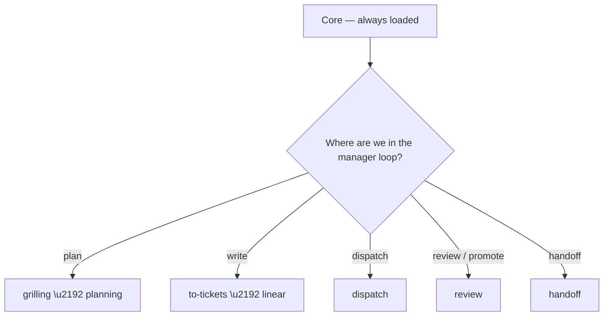

# PM

Dispatched as the guava-os manager session. Load **Core** first, then follow the tree below.

## Decision tree



## Skills

### grilling

_Relentlessly interview about a plan or design until every branch is resolved, building a shared domain language (CONTEXT.md / glossary) as you go. Use before implementing anything non-trivial._

## Grilling

The reusable interview primitive (mattpocock `grilling` / `grill-with-docs`,
distilled). Kills misalignment and verbosity before they cost code.

## Loop

1. Ask the one highest-value question on the unresolved branch.
2. Record the answer as a decision; update the shared `CONTEXT.md` / glossary.
3. Repeat until every branch resolves to a concrete, falsifiable decision.

## What to grill

Scope (in/out), data shapes, edge cases, failure behavior, acceptance
criteria, and naming/jargon — build the shared language as you go.

## Rules

- One question at a time; never assume; don't rush to solve.
- Every answer gets a name in the shared vocabulary (reduces later verbosity).
- Stop when more questions add no design resolution.

## Uses

- Pre-implementation alignment, domain modeling, ADR drafting
- Feeds `to-tickets` with a resolved, unambiguous plan

## Source

mattpocock `productivity/grilling` + `engineering/grill-with-docs`.

### to-tickets

_Break a plan, spec, or conversation into tracer-bullet tickets with explicit blocking edges, written as Linear issues or a local file. Use after planning, before dispatch._

## To Tickets

Turn a plan into small tickets with dependency edges (mattpocock `to-tickets` +
`to-spec`, distilled; fits `planning`).

## Rules

- One ticket = one observable outcome, sized for a single worker turn.
- Declare blocking edges explicitly (native `blocks` / `blocked-by`). A hard
  result-dependency only — never "do roughly before" (GOS-44).
- Each ticket: Why / Scope / Out-of-scope / numbered pass-fail Acceptance.
- Resolve edges before creating; execution order = zero-indegree first.
- Use canonical Linear IDs after creation (`linear` skill / `pm`), never aliases.

## Steps

1. Extract outcomes from the plan (verbs, observable).
2. Sequence by real dependencies (results-needed test).
3. `pm create` each ticket via the `linear` skill; `pm link` the edges.
4. Verify: `validate` (no orphan/overflow) + `status` (0-indegree ready).

## Uses

- After planning, before dispatch; Linear ticket creation
- Input to the `dispatch` skill for fan-out

## Source

mattpocock `engineering/to-tickets` + `to-spec`.

### planning

_Sprint planning and board health — the guava-os default planning pattern. guava-os decomposes into scoped Linear deliverables; OMP subagents execute; writes go through the linear skill._

## Planning

guava-os owns planning (ADR_001). Work is decomposed into scoped Linear
deliverables; OMP subagents execute them (dispatch skill); GitHub enforces
review and merge; Linear is the workflow state of record.

## Read pattern — default, in order

1. `AGENTS.md` → playbooks (entry routing).
2. Authority docs, only as deep as the decision requires: `ADR_001.md` →
   `docs/architecture/guava-os-operating-contract.md` →
   `docs/architecture/linear-conventions.md`.
3. `.guava-os/config.json` — team, project, roles, statuses, invariants
   (e.g. `max_subtasks_per_parent`), branch pattern. Defines the shape any
   sprint must fit.
4. Tooling capability — `.guava-os/src/cli.ts` + `linear-client.ts` when unsure
   an operation exists.
5. Live Linear state, read-only — never propose writes before observing.
6. `.guava-os/registry/projects.yml` — is the target repo registered?
7. Target domain — repo README → status/sprint docs → conventions → current
   work state. Sprint scope comes from here, not the agent's head.
8. Synthesize plan + friction → operator confirmation.
9. Execute writes via the `linear` skill.
10. Verify with the board read-back.

## Operational loop (canonical)

```
Linear backlog → guava-os planning → scoped deliverables (issues) →
ready-work selection → OMP subagents (dispatch skill) → dev/<role> branch →
QA review → GitHub merge to staging → second review → production → Linear refresh
```

guava-os plans and decides; OMP executes via subagents; GitHub enforces
review/merge; workers execute; Linear is the workflow state of record.

## Work shapes (decide which before planning)

- **Container** = a Linear issue with ≥1 child (native parentId pointing at it).
  A container groups deliverables and is **never executable itself**. Sprint
  parents are containers.
- **Deliverable** = a Linear issue with **no children**. Executable when: status
  Todo, exactly one role label, and no unresolved native blockers. Child or
  standalone — both equally eligible.
- **Standalone dependency chain** = a set of top-level deliverables wired by
  native `blocks` edges. The chain head (unblocked issue) is executable.

## Sprint model

- A sprint is a Linear **container** parent + children (deliverables), OR a
  standalone dependency chain.
- Children per container ≤ `max_subtasks_per_parent` (config). **Enforced** —
  `validate` raises V305 (`subtask_overflow`, error) when an active container
  exceeds the cap.
- Every deliverable: exactly one role label; description with Why / Scope /
  Acceptance criteria (template: `docs/architecture/linear-conventions.md`).
- Workflow state = Status; labels carry metadata only (GOS-21).
- One artifact: the Linear issue **is** the task contract and the handoff
  record. There is no separate SprintDocument.

## Granular scoping — worker-fit deliverables

The point of guava-os is to create SMALL, well-scoped issues and let OMP
subagents run them in parallel. A worker (default/smol model tier) completes a
SINGLE-purpose task; it fails or runs empty on an over-broad one (the
GUA-67 / GUA-155 empty-turn + timeout failure mode). Scope for the worker, not
the ambition.

Rules:
- **One issue = one observable outcome**, doable in a single worker turn under
  the `default` (or `smol`) tier. If a task needs a stronger model than
  `default`, it is TOO BIG — split it. `default` is the max; `smol` for
  mechanical pieces; `slow` should be unnecessary when scoping is right.
- **Narrow scope**: every deliverable gets a tight `allowedPaths` and explicit
  "Out of scope". A worker without a bounded scope drifts into read-only
  exploration instead of editing.
- **Tight acceptance**: numbered, observable, pass/fail, checkable (e.g.
  "docs/foo.md contains X", "`npm test` green").
- **Big work = a container/chain of small deliverables**, run in parallel by
  OMP — never one giant issue chewed in a single worker run.
- **Decompose at planning, not execution.** Splitting an oversized ticket is a
  guava-os planning act, done before dispatch.

## MCP-assisted planning + issue scoping

For dependency-heavy sprints, research decisions through MCP tools **before**
scoping issues, so the plan rests on evidence rather than the agent's head.

1. **Research first via MCP.** Settle library / provider decisions before
   creating issues. Capture each decision as **version + license + role** in
   the container or deliverable description.
2. **Granular role deliverables.** One observable outcome per issue, sized
   for a single worker turn, exactly one role label, pass/fail acceptance.
3. **Containers cap.** Group related deliverables under containers, each ≤
   `max_subtasks_per_parent`. End the dependency set with a **QA gate issue**.
4. **Forward dependency DAG.** Wire `blocks` edges so work flows forward to the
   QA gate. Every edge is a hard result-dependency (GOS-44); never serialize
   independent work — 0-indegree tasks run in parallel.
5. **Legacy reconciliation.** Cancel subsumed issues, re-link moved deps, keep
   the board ruthless.

## Hard dependency vs preferred order (GOS-44)

A `blocks` edge means **"downstream work consumes the upstream result"** — a
hard result-dependency. It is NOT a sequencing preference.

- Use an edge only when the downstream deliverable actually needs the upstream
  output to proceed. Apply the *results-needed* test: "would downstream fail
  without the upstream result?" If no → it is not a dependency.
- **Never use `blocks` for "do roughly before" ordering.** That needlessly
  serializes independent work (OMP pipelines edged tasks instead of running
  them in parallel).
- **Independent work stays independent.** For concurrent, non-sequenced work use
  container children or unblocked standalones — OMP runs 0-indegree tasks in
  parallel.
- Fix a wrong/early edge cleanly: `pm unlink <id> --blocks/--blocked-by`
  (GOS-41).

## Role → agent

Each issue carries one role label → the OMP agent type of the same name.
Definitions: `docs/workflow/roles/<role>.md`. The `dispatch` skill dispatches.

## Identity (canonical IDs)

- Plan aliases (`S0`/`S1`/`R1`) are drafting shorthand only — allowed **before**
  Linear creation.
- Immediately on creation, adopt the canonical `GUA-###` identifier (printed by
  `pm create`) as the issue's sole identity. Use it for dependencies, reports,
  commit subjects, and execution handoff.
- The write path rejects non-canonical refs (`pm link` / `pm create --parent`),
  so never pass a raw alias into tooling after creation.

## Uses

- `pm search`, `pm get-sprint`, `pm get-project` — read-only board state
- `validate`, `status`, `next` — board health, ready-work directives
- `.guava-os/registry/projects.yml` — project registration check
- Writes: via the `linear` skill — planning decides what, linear writes
- `pm link` / `pm unlink` — add / remove dependency edges (GOS-41)
- Dispatch: see the `dispatch` skill

### linear

_Project management via guava-os tooling — the standard agent interface for Linear. Prefer pm tooling; reach for Linear MCP only as a fallback. Linear is the workflow state of record._

## Linear Project Management

**Rule:** agents use guava-os skills → guava-os tooling → Linear. Prefer
skills and native tools first; reach for Linear MCP only as a fallback.

Tooling is invoked from the guava-os checkout (`~/dev/guava-os`). Linear is the
workflow state of record: an issue is the unit of work, the worker's task
contract, and the handoff record (its comment thread).

All project management goes through `guava-os pm <subcommand>`:

```
guava-os pm get-project
guava-os pm get-sprint [parent-id]
guava-os pm get-issue <id>
guava-os pm search [--status <s>] [--label <l>] [--assignee <a>]
guava-os pm create --title "..." --team "Guava AI" [--project guava-os] [--parent <id>] [--label task] [--label backend] [--priority 2]
guava-os pm update <id> [--status "In Progress"] [--assignee me] [--priority 3]
guava-os pm link <id> --blocked-by <id>
guava-os pm unlink <id> --blocked-by <id>   # remove a dependency edge (GOS-41)
guava-os pm move <id> --status "Done"
guava-os pm assign <id> --assignee me
guava-os pm comment <id> --body "..."
```

### Conventions (GOS-21)

- **Native fields first**: Status, Assignee, Priority, Project, Parent, Dependencies.
- **Labels**: one **role** label (`task`/`reviewer`/`scout`/`designer`/`sonic`/`librarian`/`security-reviewer`) selects the subagent; one **domain** label (`pm`/`qa`/`security`/`backend`/`frontend`/`devops`/`ai-ml`) selects the skills. Any other labels are metadata.
- **Never labels for workflow state**: no ready/review/blocked/pickup. Workflow = Status.
- **One role label + one domain label per issue.**

### Identity (GOS-38 create)

- After Linear creation the canonical identifier (`GUA-###`) is the issue's
  **sole identity**. Use it for dependencies, reports, commit subjects, and
  handoff.
- The write path rejects non-canonical refs. Never pass a plan alias (`S0`/`R1`)
  into tooling after creation.

### Branching model (ADR_001 Amendment 2)

```
production   ← protected: PR from staging + required review + required CI
    ↑
staging      ← protected: PR from dev/* + QA review + required CI
    ↑
dev/task   dev/reviewer   ...   (one per role; workers push here)
```

- Workers push to `dev/<role>` — never to staging/production.
- Every commit subject carries `GUA-### <outcome>` so QA can map commits to
  issues and acceptance criteria.
- Promotion is two-gated: QA review to staging, then a second review to
  production. GitHub enforces both.

### Standard workflows

#### pick work

Find executable work for a role:

```bash
guava-os pm search --status Todo --label task
```

Pick the first unblocked issue (check dependencies). Move to In Progress:

```bash
guava-os pm move GUA-50 --status "In Progress"
guava-os pm assign GUA-50 --assignee me
```

#### create issue

```bash
guava-os pm create \
  --title "GUA-N — <short outcome>" \
  --team "Guava AI" \
  --project guava-os \
  --parent GUA-44 \
  --label task --label backend \
  --priority 2 \
  --description "$(cat <<'EOF'
## Why this exists
...

## Scope
...

## Out of scope
...

## Acceptance criteria
1. ...
EOF
)"
```

The description **is** the worker's task contract and the subagent's prompt.

#### worker result handoff (clean handoff protocol)

When a worker finishes, it records the result on the issue — this is the
authoritative handoff, not a side note:

```bash
guava-os pm move GUA-50 --status "In Review"
guava-os pm comment GUA-50 --body "$(cat <<'EOF'
## Result
- Changed: <files>
- Commit: <sha> on dev/<role>
- Verification: <test output / grep proof>
- Acceptance: 1. ✅ 2. ✅ 3. ⚠️ (blocked on ...)
EOF
)"
```

Next session (any agent) resumes by reading `pm get-issue GUA-50` — the issue
+ comment thread is the state.

#### review issue

Read the issue, check acceptance criteria against the diff, comment:

```bash
guava-os pm get-issue GUA-50
guava-os pm comment GUA-50 --body "Acceptance verified: ..."
```

#### complete issue

Move to Done when acceptance criteria are met and merged:

```bash
guava-os pm move GUA-50 --status "Done"
```

#### dependencies: add, fix, and remove edges (GOS-41 / GOS-44)

- `pm link <id> --blocks/--blocked-by` creates a native `blocks` relation.
- `pm unlink <id> --blocks/--blocked-by` removes one.
- A `blocks` edge means a **hard result-dependency**. Never use it for "roughly
  before" ordering (GOS-44).

### Authentication

Set `LINEAR_API_KEY` env var (Linear Settings → API → Personal API keys).

## Uses

- `pm create`, `pm update`, `pm link`, `pm unlink`, `pm move`, `pm assign`, `pm comment` — all Linear writes
- `pm get-issue`, `pm get-project` — issue/project reads (board-wide reads belong to `planning`)
- Issue template + branching: `docs/architecture/linear-conventions.md` (GOS-21)

### dispatch

_Project-session dispatcher — load this repo's open Linear issues and delegate each to an OMP role subagent. guava-os planned; the subagents execute._

## Dispatch

A project session is a **dispatcher**, not an executor. Planning and scoping
happened upstream in guava-os. This session: loads the project's open issues
and delegates each to a subagent of the issue's role.

## Loop

1. **Gate** — `guava-os work` (this project). Nothing open → close the session.
2. **Load** — read the open issues; each carries one role label
   (`task` / `reviewer` / `scout` / `designer` / `sonic` / `librarian`), a
   tight scope, and numbered acceptance.
3. **Dispatch** — fan out each open issue to an OMP subagent of that role
   (`task agents, agent: <role>`), with the issue's Why/Scope/Acceptance as the
   task and an `outputSchema` for the typed result.
4. **Isolate** — each subagent edits in an isolated worktree (`isolated: true`).
5. **Hand off** — on completion, write the result comment and move status
   (`pm comment` + `pm move`); see the role tree for the exact steps.

## Decision tree

Each role has its own decision tree under `docs/workflow/roles/`. The subagent
follows its role's tree; the dispatcher does not implement.

## Roles → agent type

| Label | OMP agent |
|---|---|
| `task` | task |
| `reviewer` | reviewer |
| `scout` | scout |
| `designer` | designer |
| `sonic` | sonic |
| `librarian` | librarian |

## Uses

- `guava-os work` — session gate (open issues for this project)
- `task` — dispatch a subagent per open issue (agent = issue role)
- `pm comment` / `pm move` — result handoff (via the `linear` skill)
- `docs/workflow/roles/<role>.md` — the per-role decision tree

### handoff

_Read/write session handoff notes — the Linear issue + comment thread is the state of record._

## Session Handoff

The authoritative workflow state is the **Linear issue + its comment thread**.
Read it with `pm get-issue <id>`; write results with `pm comment` + `pm move`
(via the `linear` skill). Handoff notes are non-authoritative continuity only.

Canonical reference: `docs/architecture/linear-conventions.md`. Authority:
`ADR_001.md` → `docs/architecture/guava-os-operating-contract.md`.

## Uses

- `pm get-issue <id>` — authoritative issue state + handoff record
- `pm comment` / `pm move` — write results (via the `linear` skill)
- Session notes — non-authoritative continuity only

### add-skill

_Add a new skill to this workspace's canonical skill store and wire it into consumers (omp, claude). Use when asked to add/install/download a skill, make a skill available, or after fetching a skill via the skills ecosystem (npx skills add). Provenance: single source of truth for skills is ~/.agents/skills; every consumer (project .omp/skills, project .claude/skills, ~/.claude/skills) references it via symlinks; no duplicate real copies live anywhere else._

# add-skill (skill management)

The workspace keeps **one** canonical skills store: `~/.agents/skills/<name>/` (real dirs). Consumers reference it via symlinks only. This skill standardizes adding a new skill so the "hiccups" (dangling links, duplicate copies, manual copy-into-.omp) never recur.

## Core principles

1. **Single source of truth.** A skill's real files exist ONLY at `~/.agents/skills/<name>`. Never create a duplicate real `SKILL.md` in another project dir. Referencing = symlink.
2. **Canonical before referenced.** Add the skill to the canonical store FIRST, then symlink it into consumers.
3. **No dangling, no duplicates.** Every symlink must resolve; no real copies outside canonical. After any add, run the verification (below) and confirm 0 broken links + 0 extra real SKILL.md.
4. **Verify.** Frontmatter must parse (name/description/metadata) and a consumer read must return the content before calling it done.

## What every skill dir looks like

```
~/.agents/skills/<name>/
  SKILL.md          # YAML frontmatter (name, description, metadata{author,version}) + body
  assets/           # optional helper scripts (e.g. add-skill.sh)
  references/       # optional deeper docs
  CHANGELOG.md      # optional, for downloaded skills
```

## How to add a skill

### A. Download from the ecosystem (preferred)
```bash
npx skills add <owner>/<repo> -s <skill-name> -g     # global -> ~/.agents/skills + ~/.claude/skills
```
- `-g` installs user-global, landing directly in `~/.agents/skills/<name>` (the canonical store) + a `~/.claude/skills` link. Do NOT use project-scoped `skills add` (it would create a non-canonical `./.agents/skills`).
- If it landed in `./.claude/skills`/`./.agents/skills` in the cwd instead (project scope), move the real dir into `~/.agents/skills/<name>` and remove the project copy.
- Always use `-l` first to list a package's skills before installing.

### B. Author a new one manually
```bash
mkdir -p ~/.agents/skills/<name>
# write SKILL.md with valid frontmatter:
#   ---
#   name: <name>
#   description: "Triggers + scope..."
#   metadata: { author: ..., version: "0.1.0" }
#   ---
```

## Wiring into consumers

```bash
CANON=~/.agents/skills/<name>
for d in \
  /Users/sebroot/dev/guava-os/.omp/skills \
  /Users/sebroot/dev/repos/resume-site/.omp/skills \
  /Users/sebroot/.claude/skills; do
  ln -s "$CANON" "$d/<name>"
done
```
Add to the other project `.claude/skills` dirs (guava-site, demo-dashboard) only if the skill is needed there.

### Verify (acceptance)
1. `test -f ~/.agents/skills/<name>/SKILL.md`
2. No broken links: any symlink whose target is missing under the skill roots is an ERROR.
3. No duplicate real content: `find <roots> -name SKILL.md` must return ONLY canonical (plus symlink-resolved ones — they resolve into canonical, which is fine).
4. Frontmatter parses (name == dirname; description present; metadata.author + version present).
5. A consumer read returns the SKILL.md body.

### Commit reference changes
- The `.omp/skills` dirs are git-tracked in `guava-os` and `resume-site` → `git add -A` + commit the new symlink.
- `~/.agents/skills` is user-global (not in a repo) — no commit.

## Restoring the store on a fresh machine / after wipe
The canonical store is `~/.agents/skills` (not in git). To rebuild:
1. Clone `guava-os`; the previous real skill content is in git history under `.omp/skills/<name>/` (the repo now tracks symlinks). Restore real dirs from the commit BEFORE the symlink refactor, or
2. Re-run the download for ecosystem skills (step A), and reconstruct hand-authored ones (linear, planning, dispatch, verify, handoff, review, add-skill, supabase, vercel) from `~/.agents/skills` backups or the guava-os git history.

See `MANIFEST.md` in `~/.agents/skills` for the index + provenance.

### context-assembly

_Assemble a worker's context as a compiler: small stable core + explicit task contract + activated guidance + progressive retrieval + measurable verification. Use to build the prompt a dispatched worker receives._

## Context Assembly

Assemble agent context around one principle: **small stable core, explicit task
context, progressive retrieval, measurable verification.** Full skills are
reference material, not default prompt. The worker starts with enough to execute
correctly, then loads deeper guidance only when the task needs it.

## How it works

Run `node manual/scripts/inject.mjs <task.json>` — it reads the task spec +
the skill store and emits a four-tier context:

1. **Core** — pulled from `engineering-principles` (`## Invariants`,
   `## Execution protocol`, `## Completion contract`). Always injected.
2. **Task contract** — objective, scope, exclusions, acceptance, state.
3. **Activated guidance** — short `guidance` bullets for the matched domain.
4. **Available skills** — `skill://<name>` + `load_when`, for progressive
   retrieval. The full SKILL.md body loads only when the agent decides it's
   needed (Anthropic "progressive disclosure"; OpenAI "map, not manual").

## Support data

- Domain decision tree: `manual/scripts/trees.mjs` (question → branch → ordered
  sub-chain), shared by `gen.mjs` (manual mermaid) and `inject.mjs` (routing map).
- Skill metadata: `domain` / `role` / `order` / `load_when` / `guidance` in each
  SKILL.md frontmatter.

## Rules

- Never inject full skill bodies by default — advertise, don't repeat.
- The core is stable and shared; keep it in `engineering-principles`, not in code.
- Verification is tracked in the completion contract: commands run, acceptance
  evidence, changed files, deviations, blockers, commit SHA.

## Uses

- `dispatch` hands each worker its context
- `manual/scripts/inject.mjs` builds it; `manual/scripts/gen.mjs` renders the manual

