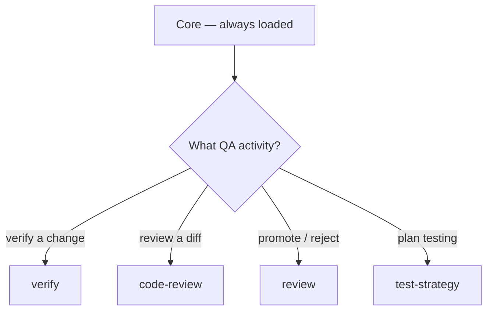

# QA

Dispatched as `reviewer`. Load **Core** first, then follow the tree below.

## Decision tree



## Skills

### verify

_Run quality gates — type check, test, scope check._

## Quality Verification

Run the quality gates before a worker commits and before QA approves.

Targets:

- `types` — `npx tsc --noEmit`
- `test` — `npx vitest run`
- `scope` — `git diff --name-only` and confirm every changed file is within the
  issue's allowed scope (no out-of-scope edits)
- (empty) — run all gates in sequence

Report results as a table:

| Gate | Status | Details |
|------|--------|---------|

Arguments: `$ARGUMENTS`

## Uses

- `npx tsc --noEmit` — types gate
- `npx vitest run` — test gate
- `git diff --name-only` — scope gate

### code-review

_Two-axis diff review — Standards (repo conventions + code smells) and Spec (did it implement the originating issue) — plus adversarial challenge with a synthesized verdict. Use when reviewing a PR, branch, or work-in-progress changes._

## Purpose

Review changes since a fixed point along two independent axes and synthesize a verdict. The axes stay separate so one can't mask the other; adversarial input strengthens confidence.

## Axes

- **Standards** — does the code follow the repo's documented conventions AND avoid baseline code smells?
- **Spec** — does the code faithfully implement the originating issue/spec (no missing requirements, no scope creep)?

A change can pass one and fail the other. Standards-pass/Spec-fail = the wrong thing done cleanly; Spec-pass/Standards-fail = the right thing done against conventions. Never merge or rerank findings across axes.

## Standards axis — smell baseline

These apply even when a repo documents nothing. A documented repo standard always overrides a baseline flag; each smell is a judgement call, not a hard violation.

| Smell | Signal → fix |
|-------|--------------|
| Mysterious Name | name doesn't reveal purpose → rename |
| Duplicated Code | same logic shape in >1 hunk/file → extract shared |
| Feature Envy | reaches into another object's data more than its own → move method |
| Data Clumps | same few fields travel together → bundle into a type |
| Primitive Obsession | primitive stands in for a domain concept → give it a small type |
| Repeated Switches | same switch/if-cascade recurs → polymorphism or shared map |
| Shotgun Surgery | one change edits many files → gather into one module |
| Divergent Change | one module edited for unrelated reasons → split |
| Speculative Generality | abstraction/params/hooks the spec doesn't need → delete |
| Message Chains | long `a.b().c().d()` → hide walk behind one method |
| Middle Man | class mostly delegates → cut it |
| Refused Bequest | subclass ignores most inherited behavior → use composition |

## Spec axis

Find requirements that are:

1. **Missing or partial** — asked for but absent/incomplete.
2. **Scope creep** — implemented but never asked for.
3. **Wrong** — implemented but doesn't match the spec.

Quote the spec line for each finding.

## Process

1. Pin the fixed point (`git diff <fixed>...HEAD`, three-dot vs merge-base). Fail fast on a bad ref or empty diff.
2. Locate the spec: issue refs in commit messages → user-passed path → `docs/`/`specs/` → ask. If none, Spec axis reports "no spec available".
3. Identify standards sources (`CODING_STANDARDS.md`, `CONTRIBUTING.md`, etc.).
4. Run both axes in parallel (sub-agents or co-reviewers) so context doesn't cross-pollinate.
5. Synthesize a verdict; do not auto-apply changes.

## Synthesizing the verdict

Categorize every finding as a pragmatic senior engineer:

- **Act on** — real correctness/security/maintainability issues blocking a PR.
- **Consider** — legitimate, but might not outweigh the cost now.
- **Noted** — valid but low-impact/context-dependent.
- **Dismissed** — wrong, nitpicky, or missing context (say why, so the author can override).

Agreement across independent reviewers is high-confidence signal; lone findings are worth reading but weigh lower. Deduplicate findings multiple reviewers describe differently.

## Uses

- Reviewing a PR, branch, or WIP diff against its originating issue
- Adversarial "tear this apart" reviews from independent angles
- Pre-merge sanity checks combining conventions and spec fidelity

## Source

Distilled from `mattpocock/skills` — `engineering/code-review` — and `cursor/plugins` pstack — `interrogate`.

### review

_QA review and promotion — read the diff, check acceptance, run tests, approve (merge to staging) or reject. Evidence is git + PR + CI. guava-os decides; GitHub enforces._

## Review

guava-os owns review decisions (operator/QA-facing). GitHub enforces them via
branch protection and required review. Evidence is the diff, the commit
history, and CI results — there is no custom audit chain (ADR_001 Amendment 2).

## Acceptance review

For each issue in In Review: read the issue's acceptance criteria, inspect the
diff (`git`), run tests (`verify`), and check the result comment. Then verdict.

## Promotion gates

Two gates, both GitHub-enforced:

1. **dev → staging** — QA review: diff is in-scope, acceptance criteria met,
   tests green. **Approve** = merge PR `dev/<domain>` → `staging`. **Reject** =
   comment the reason on the issue, move status back to In Progress.
2. **staging → production** — a second, separate operator review before merge.

## Verdict surface

```bash
gos pm comment <id> --body "Verdict: <approve|reject>. Evidence: ..."
gos pm move <id> --status "Done"          # on approve
gos pm move <id> --status "In Progress"   # on reject
```

Merge via `git`/PR — GitHub branch protection is the enforcement.

## Retrospective

At sprint close: what shipped, what stalled, board hygiene. Feed the next
planning pass.

## Uses

- `pm get-issue`, `pm comment`, `pm move` — verdict + board update
- `git` — diff inspection, merge
- `verify` — tests
- GitHub PR — required review + status checks

### test-strategy

_Design a multi-layer testing strategy — unit, integration, E2E, performance, and security — following the test pyramid. Use when planning test coverage, writing tests, designing automation, or auditing coverage gaps and flaky tests._

## Purpose

Pick the right test layer per change and ensure each layer asserts real behavior, not implementation details. Default to the pyramid: many fast unit tests, fewer integration tests, fewest E2E tests.

## Test pyramid

```
        ▲  E2E        — few, critical user journeys
       ▲▲  Integration— real components, real DB/API
      ▲▲▲  Unit       — many, fast, isolated logic
```

- **Unit** (most): pure logic, edge cases. Fast, deterministic, mock external deps.
- **Integration** (middle): components wired together; real DB/API where practical.
- **E2E** (fewest): critical paths (registration, checkout, core workflow) through the real UI.
- **Performance & security**: separate, targeted; not in the normal loop.

## Unit testing

- Test happy path + error/edge cases (empty, null, boundary, max).
- Mock external deps — never hit real APIs/DBs/file systems.
- Assert specific outcomes (`expect(result).toBe(90)`), not truthiness; test observable behavior, not internals.
- Use plain-English `it('…')`/`test_…` names that read as a spec.
- Isolate: each test independently runnable; no order dependence; fixtures/factories, never production data.

## Integration testing

- Exercise the real wiring: request → route → service → repository → DB.
- Cover contract edges — validation (400/422), auth (401), not just 201/200 happy paths.
- Seed and clean data per test; use a dedicated test DB.

## E2E testing

Prioritize critical user paths (P0: registration/login/core; P1: payment/settings; P2/P3: edge/admin).

- Drive the real UI (Playwright/Cypress); assert visible outcomes, not selectors.
- Test happy path + validation errors + empty/max states.
- Cover cross-browser/mobile before major releases only.

## Performance testing

Match the question to the test type (k6/Artillery):

| Type | Purpose |
|------|---------|
| Load | normal expected traffic |
| Stress | find the breaking point |
| Spike | sudden traffic surge |
| Soak | long-duration stability |

Set explicit thresholds — `p(95)<500ms`, error `rate<0.01` — and fail CI on breach.

## Security testing

| Category | Tests |
|----------|-------|
| Auth | wrong creds, expired/tampered tokens, rate-limit trigger (429) |
| Authorization | IDOR (other user's resource → 403), privilege escalation |
| Input | reject SQLi (`'; DROP TABLE--`) and XSS payloads |
| Headers | CSP, HSTS, X-Frame-Options present |
| Data | no PII/stack traces in errors |

## Constraints

- Fail on coverage gaps; flag them explicitly rather than padding with trivial tests.
- Treat flakiness as a bug: isolate ordering/async issues and fix; never re-run until green.
- Error paths are mandatory — don't test only the success branch of a try/catch.

## Uses

- Planning test coverage for a feature or repo
- Choosing unit vs integration vs E2E for a specific change
- Adding load/soak/spike or security test suites
- Debugging flaky/order-dependent tests

## Source

Distilled from `Jeffallan/claude-skills` — `test-master` (SKILL.md + `references/unit-testing.md`, `integration-testing.md`, `e2e-testing.md`, `performance-testing.md`, `security-testing.md`).

