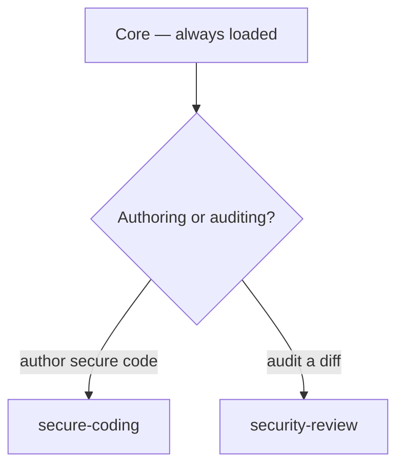

# Security

Dispatched as `security-reviewer`. Load **Core** first, then follow the tree below.

## Decision tree



## Skills

### secure-coding

_Write secure code and avoid common vulnerabilities — injection, broken auth, XSS/CSRF, SSRF, secrets handling, and access control. Use when implementing authentication, input validation, encryption, or any OWASP Top 10-sensitive code path._

## Purpose

Guide writing code that resists the OWASP Top 10. Apply whenever the change touches user input, auth, secrets, outbound requests, or data at rest/transit.

## Workflow

1. **Threat model** — identify the attack surface and what an attacker controls.
2. **Design** — pick controls before coding (defense in depth).
3. **Implement** — follow the MUST/MUST-NOT rules below.
4. **Validate** — test controls with the checkpoints at the end.

## Injection

- Parameterize every SQL query; never string-interpolate user input. `db.query('… WHERE id = $1', [id])` or an ORM.
- Never build shell commands from input. Prefer `execFile`/`spawn` with arg arrays over `exec(string)`; allowlist commands.
- For deserialization, use JSON (`JSON.parse`/`json.loads`), never `eval` or `pickle.loads` on untrusted input.

## Authentication & sessions

- Hash passwords with bcrypt/argon2 (cost ≥ 12). Never MD5/SHA-1/unsalted.
- Rate-limit auth endpoints and lock accounts after repeated failures.
- Issue short-lived, scoped tokens; allowlist the algorithm (`HS256`) and set `issuer`/`audience`.
- Return the same generic error for "no such user" and "wrong password" — never leak account existence.
- Cookies: `httpOnly`, `secure`, `sameSite: 'strict'`.

## Authorization & access control

- Deny by default; enforce server-side on every handler, never rely on hidden client state.
- Check ownership, not just identity: filter by `userId`/tenant in the query (IDOR defense).
- Verify role for privileged routes; test horizontal AND vertical escalation paths.

## Secrets

- Secrets live in env vars or a secret manager — never in source, config committed to git, or logs.
- Redact sensitive fields in logs and error responses; return generic 500s, never stack traces with internals.

## XSS / CSRF / SSRF

- **XSS**: output-encode. Use `textContent`, React auto-escaping, or DOMPurify for HTML; never `innerHTML`/`dangerouslySetInnerHTML` with raw input. Set CSP.
- **CSRF**: require a token on state-changing requests; use `sameSite` cookies.
- **SSRF**: validate any URL the server fetches. Allowlist schemes (`http`/`https`) and hosts; block internal addresses (`127.0.0.0/8`, `169.254.169.254`, `::1`, RFC 1918); resolve DNS and re-check the resolved IP against the allowlist.

## Validate

After implementing, confirm:

- SQL injection payloads (`' OR 1=1--`) and XSS (`<script>`) are rejected/escaped.
- Brute-force lockout/rate limit triggers; tokens reject tamper/expiry.
- Security headers present (CSP, HSTS, X-Frame-Options, nosniff) and CORS allowlist correct.

## Uses

- Implementing login, JWT/OAuth, or session handling
- Adding input validation or parameterized queries
- Writing any handler that touches user-supplied data, files, shells, or outbound URLs
- Hardening an existing endpoint against a reported vulnerability

## Source

Distilled from `Jeffallan/claude-skills` — `secure-code-guardian` (SKILL.md + `references/owasp-prevention.md`).

### security-review

_Read-only, evidence-backed security audit of a diff or repository — SAST-style manual review covering auth, input handling, crypto, secrets, and dependencies. Use when asked to review code for vulnerabilities, audit a PR/repo for security, or produce a prioritized findings report. Dispatched under the `security-reviewer` agent type._

## Purpose

Find real, exploitable vulnerabilities in a diff or repo and report them with location, impact, and remediation. Tools miss context — manual review is mandatory. Read-only: never modify code under review.

## Workflow

1. **Scope** — map the attack surface: entry points (routes, handlers, CLI), trust boundaries, and what each accepts.
2. **Scan** — run automated tools for signal, not verdict:
   - `semgrep --config=auto .`
   - `bandit -r ./src` (Python) / `gosec ./...` (Go)
   - `gitleaks detect --source=.` / `trufflehog`
   - `npm audit` / `trivy fs .` (deps + IaC)
3. **Review manually** — read auth, input handling, crypto, and access-control paths line by line. This is the primary phase.
4. **Classify** — confirm each finding, rate severity (Critical/High/Medium/Low) aligned to CVSS, note CWE/OWASP mapping. No PoC beyond what proves the finding.
5. **Report** — findings table + detailed entries with remediation; prioritize by severity.

## What to look for

| Category | Check |
|----------|-------|
| Auth | Missing/weak auth; token tamper/expiry; user-existence leaks; weak hashing (MD5/SHA-1/unsalted) |
| Authorization | IDOR (lookup by id without ownership check); missing role checks; horizontal/vertical escalation |
| Injection | String-interpolated SQL; `eval`/`exec`/shell with input; unsafe deserialization (`pickle`) |
| XSS | Raw `innerHTML`/`dangerouslySetInnerHTML`/`document.write`; missing output encoding or CSP |
| Path traversal | `path.join` with user filename; missing `basename`/root-prefix check |
| SSRF | Server-side fetch of user-supplied URL; no scheme/host allowlist; no DNS-rebind guard |
| Secrets | Hardcoded keys/tokens/creds; secrets in logs or error output |
| Crypto | ECB mode, static IV, `Math.random` for secrets, weak cipher suites |
| Headers/CORS | Missing CSP/HSTS/X-Frame-Options; permissive `Access-Control-Allow-Origin: *` with credentials |
| Dependencies | Known-vulnerable versions; unpinned/wide ranges |

## Constraints

- Cite exact `file:line` for every finding — never vague.
- Always give a concrete remediation, not just "fix it" — show the secure call.
- Report Critical/High immediately; don't drop Low findings just to shorten the report.
- Don't assume a framework "handles it" — verify the framework's default is actually on.
- Read-only: do not edit code; do not run active exploitation against systems you don't own.

## Finding format

```
ID: FIND-001 — High (CVSS 8.1)
Title: SQL injection in user search
File: src/api/users.py:42
Impact: attacker can read/modify/delete rows
Fix: parameterize → cursor.execute("SELECT … WHERE name=%s", (name,))
Refs: CWE-89, OWASP A03
```

## Uses

- Security review of a PR, branch, or whole repo
- SAST triage and confirming tool-reported findings
- Dependency/secrets audits
- Pre-merge security gates

## Source

Distilled from `Jeffallan/claude-skills` — `security-reviewer` (SKILL.md + `references/vulnerability-patterns.md`).

