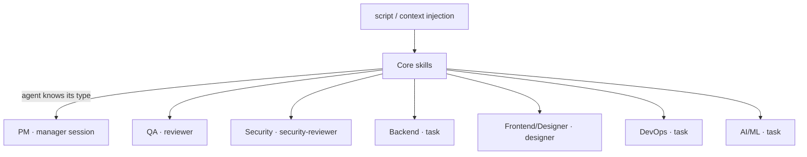
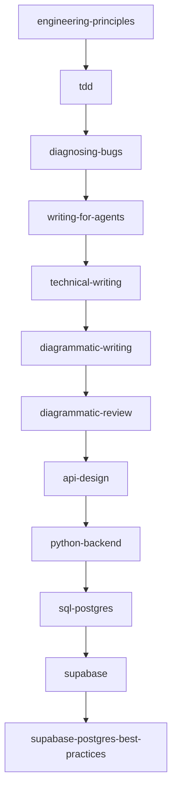
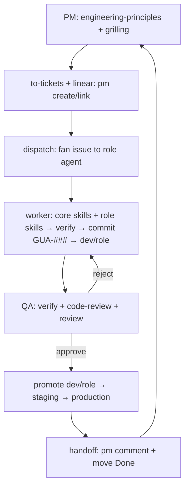
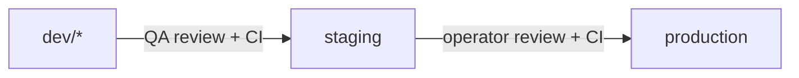

# Workflow

## High-level (every agent)

**Core skills, in order:** `engineering-principles` → `tdd` → `diagnosing-bugs` →
`writing-for-agents` → `technical-writing` → `diagrammatic-writing` →
`diagrammatic-review`. An agent loads core first, then follows its domain branch
to the ordered role workflow.

## Per-role (example: Backend)

The role pages under `roles/` carry each domain's full ordered chain plus the
full skill content — self-contained starting places.

## The operating loop (PM → workers → GitHub → Linear)

## Promotion gates

